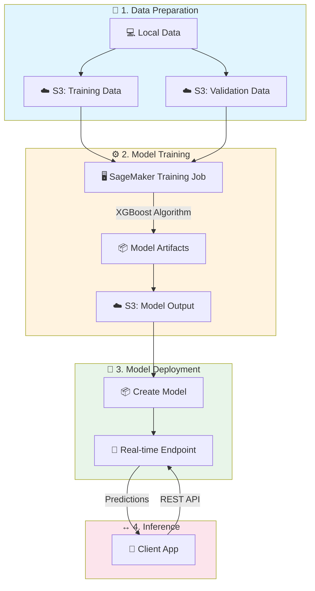
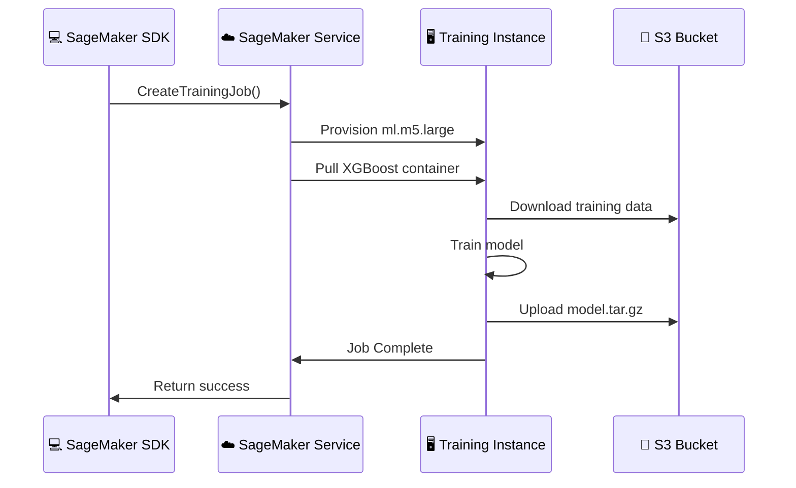

# Lab 01: Amazon SageMaker Fundamentals

## Overview
In this lab, you'll get hands-on experience with Amazon SageMaker's[^sagemaker] core capabilities including training jobs, model deployment, and inference.

**Duration**: 90-120 minutes
**Cost**: ~$5-10 (use `ml.t3.medium` to minimize costs)
**Prerequisites**: AWS Account, IAM[^iam] permissions for SageMaker

---

## Architecture Overview



### Training Job Flow



---

## Lab Objectives

By the end of this lab, you will be able to:
- [ ] Create a SageMaker notebook instance
- [ ] Prepare data and upload to S3[^s3]
- [ ] Train a model using XGBoost[^xgboost] built-in algorithm
- [ ] Deploy a model to a real-time endpoint[^endpoint]
- [ ] Make predictions and evaluate results
- [ ] Clean up resources

---

## Part 1: Environment Setup

### Step 1.1: Create IAM Role for SageMaker

1. Go to **IAM Console** → **Roles** → **Create Role**
2. Select **SageMaker** as the trusted entity
3. Attach these policies:
   - `AmazonSageMakerFullAccess`
   - `AmazonS3FullAccess` (for lab purposes; restrict in production)
4. Name the role: `SageMakerLabRole`
5. Note the Role ARN for later use

### Step 1.2: Create S3 Bucket

```bash
# Replace with your unique bucket name
BUCKET_NAME="sagemaker-lab-$(date +%Y%m%d)-$(echo $RANDOM)"
aws s3 mb s3://$BUCKET_NAME --region us-east-1
echo "Created bucket: $BUCKET_NAME"
```

### Step 1.3: Create SageMaker Notebook Instance

1. Go to **SageMaker Console** → **Notebook instances** → **Create notebook instance**
2. Configure:
   - Name: `ml-lab-notebook`
   - Instance type: `ml.t3.medium` (cost-effective for labs)
   - IAM role: Select `SageMakerLabRole`
   - Volume size: 5 GB
3. Click **Create notebook instance**
4. Wait for status to become **InService** (~3-5 minutes)
5. Click **Open JupyterLab**

---

## Part 2: Data Preparation

### Step 2.1: Create a New Notebook

1. In JupyterLab, click **File** → **New** → **Notebook**
2. Select **conda_python3** kernel
3. Name it `sagemaker-lab.ipynb`

### Step 2.2: Import Libraries and Setup

```python
# Cell 1: Import libraries
import sagemaker
import boto3
import pandas as pd
import numpy as np
from sagemaker import get_execution_role
from sklearn.model_selection import train_test_split
from sklearn.datasets import make_classification

# Get SageMaker session and role
session = sagemaker.Session()
role = get_execution_role()
bucket = session.default_bucket()
prefix = 'sagemaker-lab'

print(f"SageMaker Role: {role}")
print(f"Default Bucket: {bucket}")
print(f"Region: {session.boto_region_name}")
```

### Step 2.3: Generate Sample Dataset

```python
# Cell 2: Generate synthetic classification dataset
np.random.seed(42)

# Create dataset with 10,000 samples, 20 features
X, y = make_classification(
    n_samples=10000,
    n_features=20,
    n_informative=15,
    n_redundant=5,
    n_classes=2,
    random_state=42
)

# Create DataFrame
feature_names = [f'feature_{i}' for i in range(20)]
df = pd.DataFrame(X, columns=feature_names)
df['target'] = y

print(f"Dataset shape: {df.shape}")
print(f"\nClass distribution:\n{df['target'].value_counts()}")
df.head()
```

### Step 2.4: Split and Format Data for SageMaker

```python
# Cell 3: Split data into train/validation/test
# IMPORTANT: SageMaker expects target column FIRST for built-in algorithms

train_df, temp_df = train_test_split(df, test_size=0.3, random_state=42)
val_df, test_df = train_test_split(temp_df, test_size=0.5, random_state=42)

print(f"Training samples: {len(train_df)}")
print(f"Validation samples: {len(val_df)}")
print(f"Test samples: {len(test_df)}")

# Reorder columns: target first (SageMaker convention)
columns = ['target'] + feature_names
train_df = train_df[columns]
val_df = val_df[columns]
test_df = test_df[columns]

# Save locally (no header for SageMaker built-in algorithms)
train_df.to_csv('train.csv', index=False, header=False)
val_df.to_csv('validation.csv', index=False, header=False)
test_df.to_csv('test.csv', index=False, header=False)

print("\nData saved locally")
```

### Step 2.5: Upload Data to S3

```python
# Cell 4: Upload to S3
train_path = session.upload_data('train.csv', bucket=bucket, key_prefix=f'{prefix}/train')
val_path = session.upload_data('validation.csv', bucket=bucket, key_prefix=f'{prefix}/validation')
test_path = session.upload_data('test.csv', bucket=bucket, key_prefix=f'{prefix}/test')

print(f"Training data: {train_path}")
print(f"Validation data: {val_path}")
print(f"Test data: {test_path}")
```

---

## Part 3: Train Model with XGBoost[^xgboost]

### Step 3.1: Configure XGBoost Estimator[^estimator]

```python
# Cell 5: Get XGBoost container image
from sagemaker.image_uris import retrieve

xgboost_image = retrieve(
    framework='xgboost',
    region=session.boto_region_name,
    version='1.5-1'
)

print(f"XGBoost Image: {xgboost_image}")
```

### Step 3.2: Create Estimator and Set Hyperparameters[^hyperparameters]

```python
# Cell 6: Create XGBoost Estimator
from sagemaker.estimator import Estimator

xgb_estimator = Estimator(
    image_uri=xgboost_image,
    role=role,
    instance_count=1,
    instance_type='ml.m5.large',  # Use larger instance for faster training
    output_path=f's3://{bucket}/{prefix}/output',
    sagemaker_session=session,

    # Hyperparameters
    hyperparameters={
        'objective': 'binary:logistic',
        'num_round': 100,
        'max_depth': 5,
        'eta': 0.2,
        'subsample': 0.8,
        'colsample_bytree': 0.8,
        'eval_metric': 'auc'
    }
)

print("Estimator configured")
```

### Step 3.3: Define Input Channels and Start Training

```python
# Cell 7: Configure input channels
from sagemaker.inputs import TrainingInput

train_input = TrainingInput(
    s3_data=train_path,
    content_type='text/csv'
)

val_input = TrainingInput(
    s3_data=val_path,
    content_type='text/csv'
)

# Start training job
print("Starting training job...")
xgb_estimator.fit(
    inputs={
        'train': train_input,
        'validation': val_input
    },
    wait=True  # Wait for completion
)

print("\nTraining completed!")
print(f"Model artifacts: {xgb_estimator.model_data}")
```

**🔍 Observation Point**: While training runs, go to **SageMaker Console** → **Training jobs** and observe:
- Training job status
- CloudWatch logs
- Resource utilization metrics

---

## Part 4: Deploy Model

### Step 4.1: Deploy to Real-time Endpoint[^endpoint]

```python
# Cell 8: Deploy model to endpoint
from sagemaker.serializers import CSVSerializer
from sagemaker.deserializers import JSONDeserializer

predictor = xgb_estimator.deploy(
    initial_instance_count=1,
    instance_type='ml.t2.medium',  # Smaller instance for inference
    serializer=CSVSerializer(),
    deserializer=JSONDeserializer()
)

endpoint_name = predictor.endpoint_name
print(f"Endpoint deployed: {endpoint_name}")
```

**⏱️ Note**: Deployment takes 5-10 minutes. While waiting, explore:
- **SageMaker Console** → **Endpoints**
- **SageMaker Console** → **Models**

### Step 4.2: Test the Endpoint

```python
# Cell 9: Make predictions
# Get test samples (without target column)
test_samples = test_df.drop('target', axis=1).values[:10]
actual_labels = test_df['target'].values[:10]

# Make predictions
predictions = []
for sample in test_samples:
    # Convert to CSV format
    payload = ','.join(map(str, sample))
    response = predictor.predict(payload)
    predictions.append(response)

# Display results
print("Sample Predictions:")
print("-" * 50)
for i, (pred, actual) in enumerate(zip(predictions, actual_labels)):
    prob = pred if isinstance(pred, float) else pred[0] if isinstance(pred, list) else float(pred)
    predicted_class = 1 if prob > 0.5 else 0
    status = "✓" if predicted_class == actual else "✗"
    print(f"Sample {i+1}: Prob={prob:.4f}, Predicted={predicted_class}, Actual={actual} {status}")
```

### Step 4.3: Batch Predictions

```python
# Cell 10: Make batch predictions on all test data
import io

# Prepare batch payload
test_features = test_df.drop('target', axis=1)
batch_payload = test_features.to_csv(index=False, header=False)

# Get predictions (may need to split for large datasets)
batch_predictions = predictor.predict(batch_payload)

# Calculate accuracy
if isinstance(batch_predictions, list):
    pred_probs = np.array(batch_predictions)
else:
    pred_probs = np.array([float(p) for p in batch_predictions.strip().split('\n')])

pred_classes = (pred_probs > 0.5).astype(int)
actual_classes = test_df['target'].values

accuracy = (pred_classes == actual_classes).mean()
print(f"\nTest Accuracy: {accuracy:.4f}")
```

---

## Part 5: Experiment with Hyperparameter Tuning[^hpo] (Optional)

### Step 5.1: Set Up HPO[^hpo] Job

```python
# Cell 11: Configure HPO
from sagemaker.tuner import (
    HyperparameterTuner,
    IntegerParameter,
    ContinuousParameter
)

# Define hyperparameter ranges
hyperparameter_ranges = {
    'max_depth': IntegerParameter(3, 10),
    'eta': ContinuousParameter(0.01, 0.3),
    'subsample': ContinuousParameter(0.5, 1.0),
    'colsample_bytree': ContinuousParameter(0.5, 1.0),
    'num_round': IntegerParameter(50, 200)
}

# Create base estimator for tuning
xgb_estimator_hpo = Estimator(
    image_uri=xgboost_image,
    role=role,
    instance_count=1,
    instance_type='ml.m5.large',
    output_path=f's3://{bucket}/{prefix}/hpo-output',
    hyperparameters={
        'objective': 'binary:logistic',
        'eval_metric': 'auc'
    }
)

# Create tuner
tuner = HyperparameterTuner(
    estimator=xgb_estimator_hpo,
    objective_metric_name='validation:auc',
    objective_type='Maximize',
    hyperparameter_ranges=hyperparameter_ranges,
    max_jobs=6,           # Total tuning jobs
    max_parallel_jobs=2,   # Concurrent jobs
    strategy='Bayesian'
)

print("Tuner configured")
```

### Step 5.2: Start Tuning Job (Skip if short on time)

```python
# Cell 12: Start tuning (takes 15-30 minutes)
# Uncomment to run:

# tuner.fit({
#     'train': train_input,
#     'validation': val_input
# })

# # Get best training job
# best_job = tuner.best_training_job()
# print(f"Best training job: {best_job}")
#
# # Get best hyperparameters
# best_hyperparams = sagemaker.HyperparameterTuningJobAnalytics(tuner.latest_tuning_job.name)
# print(best_hyperparams.dataframe())

print("HPO code ready - uncomment to run (takes 15-30 minutes)")
```

---

## Part 6: Clean Up Resources

**⚠️ IMPORTANT**: Always clean up to avoid ongoing charges!

### Step 6.1: Delete Endpoint

```python
# Cell 13: Delete endpoint
predictor.delete_endpoint()
print(f"Endpoint {endpoint_name} deleted")
```

### Step 6.2: Delete Model and Artifacts

```python
# Cell 14: Clean up model
# Delete the SageMaker model
sm_client = boto3.client('sagemaker')

# List and delete models created in this lab
models = sm_client.list_models(NameContains='xgboost')
for model in models['Models']:
    try:
        sm_client.delete_model(ModelName=model['ModelName'])
        print(f"Deleted model: {model['ModelName']}")
    except:
        pass
```

### Step 6.3: Clean Up S3 (Optional)

```bash
# Run in terminal to delete lab data
aws s3 rm s3://$BUCKET_NAME/$prefix --recursive
```

### Step 6.4: Stop Notebook Instance

1. Go to **SageMaker Console** → **Notebook instances**
2. Select `ml-lab-notebook`
3. Click **Actions** → **Stop**

**💰 Cost Note**: Stopped notebooks don't incur compute charges, only storage.

---

## Lab Challenges

Test your understanding with these additional exercises:

### Challenge 1: Change Algorithm
Modify the lab to use **Linear Learner** instead of XGBoost.

<details>
<summary>Hint</summary>

```python
from sagemaker.image_uris import retrieve
linear_image = retrieve('linear-learner', session.boto_region_name)
```

Use hyperparameters: `predictor_type='binary_classifier'`
</details>

### Challenge 2: Use Spot Instances[^spot]
Modify the training job to use Spot instances for cost savings.

<details>
<summary>Hint</summary>

Add to Estimator:
```python
use_spot_instances=True,
max_wait=3600,
max_run=1800,
checkpoint_s3_uri=f's3://{bucket}/{prefix}/checkpoints/'
```
</details>

### Challenge 3: Deploy Serverless Endpoint[^serverless]
Deploy the model to a serverless endpoint instead of real-time.

<details>
<summary>Hint</summary>

```python
from sagemaker.serverless import ServerlessInferenceConfig

serverless_config = ServerlessInferenceConfig(
    memory_size_in_mb=2048,
    max_concurrency=5
)

predictor = xgb_estimator.deploy(
    serverless_inference_config=serverless_config
)
```
</details>

---

## Lab Summary

In this lab, you learned:

| Concept | What You Did |
|---------|--------------|
| **Data Preparation** | Created dataset, formatted for SageMaker, uploaded to S3 |
| **Training** | Configured XGBoost estimator, set hyperparameters, ran training job |
| **Deployment** | Created real-time endpoint for inference |
| **Inference** | Made single and batch predictions |
| **HPO** | Configured hyperparameter tuning (optional) |
| **Cleanup** | Deleted endpoints, models to avoid charges |

---

## Exam Relevance

This lab covered these exam topics:

- ✅ SageMaker built-in algorithms (XGBoost[^xgboost])
- ✅ Training job configuration
- ✅ Instance types[^instance-types] for training/inference
- ✅ Data input formats (CSV[^csv], target-first)
- ✅ Model deployment options
- ✅ Hyperparameter tuning strategies[^hpo]
- ✅ Cost optimization (Spot instances[^spot], right-sizing)

---

## Glossary

[^sagemaker]: **SageMaker** - Fully managed AWS service for building, training, and deploying machine learning models at scale.

[^iam]: **IAM** - Identity and Access Management. AWS service for managing access permissions to AWS resources.

[^s3]: **S3** - Simple Storage Service. AWS object storage with 99.999999999% durability, used for data lakes and ML datasets.

[^xgboost]: **XGBoost** - eXtreme Gradient Boosting. A fast, scalable gradient boosting algorithm that builds an ensemble of decision trees sequentially, with each tree correcting errors from previous ones. Excellent for tabular data.

[^endpoint]: **Endpoint** - A deployed model hosted on an instance that serves real-time predictions via REST API. Incurs charges while running.

[^estimator]: **Estimator** - A SageMaker class that encapsulates training configuration including algorithm container, instance type, hyperparameters, and output location.

[^hyperparameters]: **Hyperparameters** - Configuration values set BEFORE training (e.g., learning_rate, max_depth). Unlike model parameters, these are not learned during training.

[^hpo]: **HPO** - Hyperparameter Optimization. Automated search for best hyperparameter values using strategies like Bayesian optimization, random search, or grid search.

[^spot]: **Spot Instances** - Discounted EC2 instances (up to 90% off) that AWS can reclaim with 2-minute notice. Ideal for fault-tolerant training jobs. Use checkpointing for long jobs.

[^serverless]: **Serverless Endpoint** - Pay-per-request inference endpoint that auto-scales to zero when not in use. Cost-effective for sporadic traffic patterns.

[^instance-types]: **Instance Types** - Different ML instance families: ml.m5 (general purpose), ml.c5 (compute optimized), ml.p3/p4 (GPU for deep learning), ml.inf1 (inference optimized).

[^csv]: **CSV** - Comma-Separated Values. Common format for tabular data. SageMaker built-in algorithms expect target column FIRST with no header.

---

## Next Lab

Continue to [Lab 02: S3 Data Lake](../02-s3-data-lake/LAB.md) →
