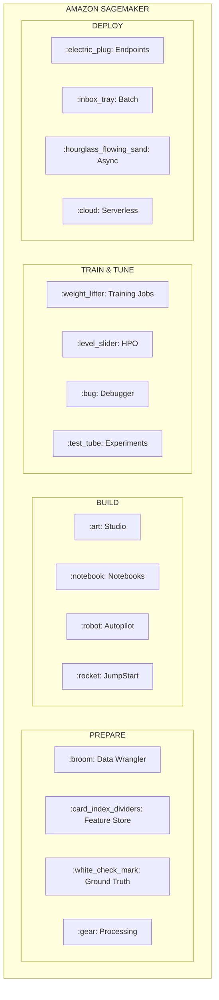
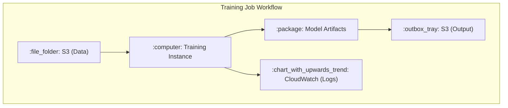
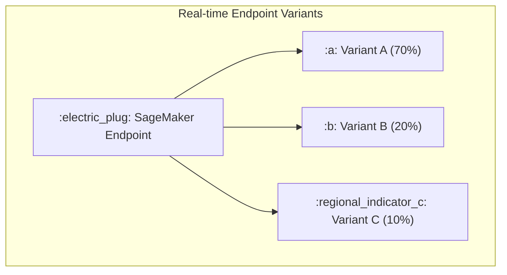
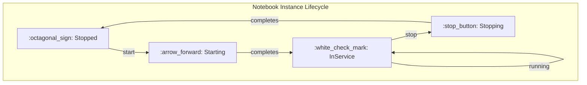
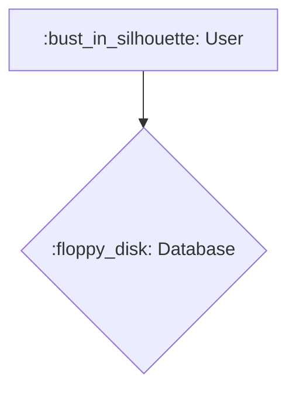

# 01 - Amazon SageMaker Basics

> **Exam Weight**: ~40% of questions involve SageMaker
> **Priority**: CRITICAL - Master this first

## What is Amazon SageMaker?

Amazon SageMaker is a fully managed ML platform that provides every component needed to build, train, and deploy machine learning models at scale.

## Key Components (Exam Focus)



---

## SageMaker Instance Types (MEMORIZE FOR EXAM)

| Instance Family | Use Case | Key Points |
|-----------------|----------|------------|
| **ml.t3** | Development, small jobs | Burstable, cheapest |
| **ml.m5** | General purpose training | Balanced CPU/memory |
| **ml.c5** | CPU-intensive compute | Feature engineering, XGBoost |
| **ml.p3** | GPU training (V100) | Deep learning training |
| **ml.p4d** | GPU training (A100) | Large model training |
| **ml.g4dn** | GPU inference | Cost-effective GPU inference |
| **ml.g5** | GPU (A10G) | Training and inference |
| **ml.inf1** | Inference (Inferentia) | Lowest cost inference, highest throughput |
| **ml.inf2** | Inference (Inferentia2) | Generative AI inference |

### Exam Tip: Instance Selection
- **"Cost-effective training"** → ml.m5 (CPU) or Spot instances
- **"Fastest deep learning training"** → ml.p4d or ml.p3
- **"Cost-effective inference"** → ml.inf1 (Inferentia) or ml.g4dn
- **"Lowest latency inference"** → ml.g4dn or ml.inf1
- **"Burstable workloads"** → ml.t3

---

## Built-in Algorithms (HIGH FREQUENCY IN EXAM)

### Supervised Learning

| Algorithm | Type | Use Case | Input Format |
|-----------|------|----------|--------------|
| **XGBoost**[^1] | Classification/Regression | Tabular data, most versatile | CSV, Parquet, RecordIO |
| **Linear Learner** | Classification/Regression | Linear problems, fast | RecordIO (recommended), CSV |
| **K-NN** | Classification/Regression | Similarity-based | RecordIO |
| **Factorization Machines** | Classification/Regression | Sparse data, recommendations | RecordIO |

[^1]: **XGBoost (eXtreme Gradient Boosting):** An optimized and scalable machine learning library that implements gradient boosting on decision trees. It's widely used for its high performance and speed in classification and regression tasks.

### Unsupervised Learning

| Algorithm | Type | Use Case | Input Format |
|-----------|------|----------|--------------|
| **K-Means** | Clustering | Group similar items | RecordIO, CSV |
| **PCA** | Dimensionality Reduction | Reduce features | RecordIO |
| **Random Cut Forest** | Anomaly Detection | Detect outliers | RecordIO |
| **IP Insights** | Anomaly Detection | Detect suspicious IPs | CSV |

### NLP & Computer Vision

| Algorithm | Type | Use Case | Input Format |
|-----------|------|----------|--------------|
| **BlazingText** | NLP | Text classification, Word2Vec | Text files |
| **Seq2Seq** | NLP | Translation, summarization | RecordIO |
| **Object Detection** | CV | Detect objects in images | RecordIO |
| **Image Classification** | CV | Classify images | RecordIO |
| **Semantic Segmentation** | CV | Pixel-level classification | RecordIO |

### Exam Tip: Algorithm Selection
- **"Tabular data with mixed features"** → XGBoost
- **"Text classification"** → BlazingText
- **"Anomaly detection in time series"** → Random Cut Forest
- **"Recommendation system with sparse data"** → Factorization Machines
- **"Reduce dimensionality"** → PCA

---

## Data Input Modes

| Mode | Description | When to Use |
|------|-------------|-------------|
| **File Mode** | Downloads data to instance | Small-medium datasets |
| **Pipe Mode** | Streams data from S3 | Large datasets, faster startup |
| **FastFile Mode** | POSIX-compliant streaming | Large datasets, random access needed |

### Exam Tip
- **"Large dataset, reduce startup time"** → Pipe Mode
- **"Dataset doesn't fit on disk"** → Pipe Mode
- **"Need random access to data"** → FastFile Mode

---

## Training Job Workflow



### Key Training Concepts

| Concept | Description | Exam Focus |
|---------|-------------|------------|
| **Spot Training** | Use Spot instances for up to 90% savings | Checkpointing required |
| **Managed Spot** | SageMaker handles Spot interruptions | Enable checkpointing |
| **Distributed Training** | Multi-instance training | Data parallel vs Model parallel |
| **Checkpointing** | Save training state periodically | Required for Spot, resume training |

---

## Hyperparameter Tuning (HPO)

```python
# HPO searches for best hyperparameters automatically
hyperparameter_ranges = {
    'eta': ContinuousParameter(0.1, 0.5),           # Learning rate
    'max_depth': IntegerParameter(3, 10),            # Tree depth
    'subsample': ContinuousParameter(0.5, 1.0),      # Sample ratio
}
```

### Tuning Strategies

| Strategy | Description | When to Use |
|----------|-------------|-------------|
| **Bayesian** | Uses past results to guide search | Default, most efficient |
| **Random** | Random parameter combinations | Large search space, parallel |
| **Grid** | Tests all combinations | Small search space |
| **Hyperband** | Early stopping of poor performers | Resource efficiency |

### Exam Tip
- Default and recommended: **Bayesian**
- For maximum parallelization: **Random**
- **Hyperband**: Stops poorly performing jobs early

---

## Deployment Options

### Endpoint Types

| Type | Latency | Use Case | Scaling |
|------|---------|----------|---------|
| **Real-time** | Milliseconds | Interactive apps | Auto Scaling |
| **Serverless** | Cold start possible | Intermittent traffic | Automatic |
| **Async** | Minutes | Large payloads (up to 1GB) | Auto Scaling |
| **Batch Transform** | N/A | Bulk predictions | N/A |

### Real-time Endpoint Variants



| Deployment Strategy | Description | Use Case |
|--------------------|-------------|----------|
| **A/B Testing** | Split traffic between variants | Compare model versions |
| **Canary** | Small % to new, gradually increase | Safe deployments |
| **Blue/Green** | Switch all traffic at once | Zero-downtime deployment |
| **Shadow** | New model gets traffic but doesn't respond | Test in production |

### Exam Tip: Deployment Selection
- **"Intermittent traffic, cost savings"** → Serverless Inference
- **"Large payloads (>6MB)"** → Async Inference
- **"Millions of predictions offline"** → Batch Transform
- **"Low latency, consistent traffic"** → Real-time Endpoint
- **"Compare two models"** → Multi-variant endpoint (A/B testing)

---

## SageMaker Studio & Notebooks

### Studio Components
- **Studio Notebooks**: Managed Jupyter notebooks
- **Studio Lab**: Free notebook environment (limited)
- **Canvas**: No-code ML for business analysts
- **Data Wrangler**: Visual data preparation
- **Autopilot**: AutoML solution

### Notebook Instance Lifecycle



---

## SageMaker Processing

Used for data preprocessing, postprocessing, and model evaluation.

```python
from sagemaker.processing import ScriptProcessor

processor = ScriptProcessor(
    role=role,
    image_uri=image_uri,
    instance_type='ml.m5.xlarge',
    instance_count=1
)

processor.run(
    code='preprocessing.py',
    inputs=[ProcessingInput(source='s3://bucket/input', destination='/opt/ml/processing/input')],
    outputs=[ProcessingOutput(source='/opt/ml/processing/output', destination='s3://bucket/output')]
)
```

---

## Key Directory Structure (KNOW FOR EXAM)

When training job runs, SageMaker uses specific paths:

```
/opt/ml/
├── input/
│   ├── config/
│   │   ├── hyperparameters.json    # Your hyperparameters
│   │   └── resourceConfig.json     # Cluster info
│   └── data/
│       └── <channel_name>/         # Training data (e.g., /opt/ml/input/data/train/)
├── model/                          # Save model artifacts here
├── output/                         # Output artifacts
│   └── failure                     # Write failure message here
└── code/                           # Your training scripts
```

### Exam Tip
- Model artifacts MUST be saved to `/opt/ml/model/`
- Training data is in `/opt/ml/input/data/<channel>/`
- Hyperparameters in `/opt/ml/input/config/hyperparameters.json`

---

## Security

| Feature | Description |
|---------|-------------|
| **IAM Roles** | Execution role for SageMaker to access AWS resources |
| **VPC** | Run training/inference in private VPC |
| **KMS** | Encrypt data at rest (S3, EBS volumes) |
| **Network Isolation** | No internet access for containers |
| **Inter-container Encryption** | Encrypt traffic between distributed training nodes |

### Exam Tip
- **"Compliance requirement, no internet"** → Enable Network Isolation
- **"Encrypt training data"** → KMS encryption + VPC
- **"Secure distributed training"** → Inter-container encryption

---

## Cost Optimization

| Strategy | Savings | Trade-off |
|----------|---------|-----------|
| **Spot Instances** | Up to 90% | May be interrupted |
| **Savings Plans** | Up to 64% | 1-3 year commitment |
| **Right-sizing** | Variable | Monitor utilization |
| **Serverless Inference** | Pay per use | Cold starts |
| **Multi-model Endpoints** | Share instance | Added latency |
| **Inference Recommender** | Optimal instance | Requires benchmark |

---

## Sample Code

### Basic Training Job

```python
import sagemaker
from sagemaker.xgboost import XGBoost

# Initialize session
session = sagemaker.Session()
role = sagemaker.get_execution_role()

# Configure XGBoost estimator
xgb = XGBoost(
    entry_point='train.py',
    role=role,
    instance_count=1,
    instance_type='ml.m5.xlarge',
    framework_version='1.5-1',
    py_version='py3',
    hyperparameters={
        'objective': 'binary:logistic',
        'num_round': 100,
        'max_depth': 5,
        'eta': 0.2
    },
    use_spot_instances=True,              # Enable Spot
    max_wait=3600,                         # Max wait time
    max_run=1800,                          # Max training time
    checkpoint_s3_uri='s3://bucket/checkpoints/'  # Required for Spot
)

# Start training
xgb.fit({
    'train': 's3://bucket/train/',
    'validation': 's3://bucket/validation/'
})
```

### Deploy to Endpoint

```python
# Deploy model to real-time endpoint
predictor = xgb.deploy(
    initial_instance_count=1,
    instance_type='ml.m5.large',
    endpoint_name='my-xgb-endpoint'
)

# Make predictions
result = predictor.predict(test_data)

# Clean up
predictor.delete_endpoint()
```

### Batch Transform

```python
# For bulk predictions
transformer = xgb.transformer(
    instance_count=1,
    instance_type='ml.m5.xlarge',
    output_path='s3://bucket/predictions/'
)

transformer.transform(
    data='s3://bucket/test-data/',
    content_type='text/csv',
    split_type='Line'
)
```

---

## Exam Question Patterns

### Pattern 1: Instance Selection
> "A company needs to train a deep learning model as cost-effectively as possible..."

**Answer**: Use Spot instances with checkpointing on ml.p3 instances

### Pattern 2: Large Dataset
> "Training data is 500GB and current training takes too long to start..."

**Answer**: Use Pipe Mode instead of File Mode

### Pattern 3: Deployment
> "Application has unpredictable traffic with long idle periods..."

**Answer**: Serverless Inference

### Pattern 4: Algorithm Selection
> "Need to classify customer reviews as positive or negative..."

**Answer**: BlazingText (text classification) or Linear Learner

### Pattern 5: Security
> "Must ensure training containers cannot access the internet..."

**Answer**: Enable Network Isolation

---

## Checklist

- [ ] Understand all SageMaker instance types and when to use each
- [ ] Know built-in algorithms and their use cases
- [ ] Understand File vs Pipe vs FastFile mode
- [ ] Know deployment options (real-time, batch, async, serverless)
- [ ] Understand HPO strategies (Bayesian, Random, Grid, Hyperband)
- [ ] Know the /opt/ml directory structure
- [ ] Understand Spot training with checkpointing
- [ ] Know security features (VPC, KMS, Network Isolation)

---

## Diagram with Icons

Here is an example of a diagram with an emoji shortcode icon:



---

## Next Steps

After completing this module, proceed to:
- [02 - S3 Data Lake](../02-s3-data-lake/) - Understanding data storage for ML
