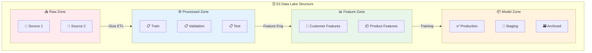
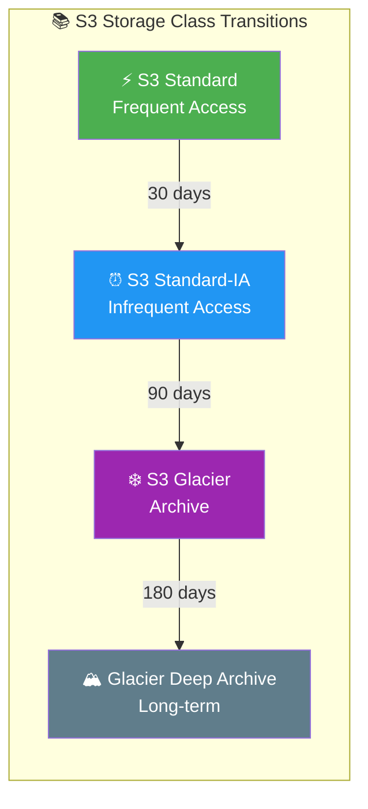
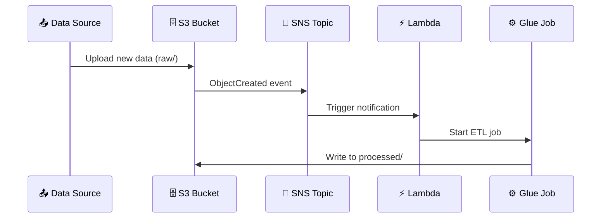

# Lab 02: S3[^s3] Data Lake for Machine Learning

## Overview
In this lab, you'll set up an S3-based data lake[^data-lake] optimized for ML workflows, including proper organization, lifecycle policies[^lifecycle], and event-driven automation.

**Duration**: 45-60 minutes
**Cost**: <$1
**Prerequisites**: AWS Account with S3 permissions

---

## Architecture Overview



### Lifecycle & Storage Classes[^storage-classes]



### Event-Driven Pipeline



---

## Lab Objectives

By the end of this lab, you will be able to:
- [ ] Create and configure an S3 bucket for ML data
- [ ] Implement proper data lake folder structure
- [ ] Set up lifecycle policies[^lifecycle] for cost optimization
- [ ] Configure event notifications
- [ ] Understand data formats and partitioning[^partitioning]
- [ ] Upload and organize training data

---

## Part 1: Create ML Data Lake Bucket

### Step 1.1: Create Bucket with AWS CLI

```bash
# Set variables
export BUCKET_NAME="ml-data-lake-$(date +%Y%m%d)-$RANDOM"
export REGION="us-east-1"

# Create bucket
aws s3 mb s3://$BUCKET_NAME --region $REGION

echo "Created bucket: $BUCKET_NAME"
```

### Step 1.2: Enable Versioning[^versioning]

```bash
# Enable versioning for model artifact tracking
aws s3api put-bucket-versioning \
    --bucket $BUCKET_NAME \
    --versioning-configuration Status=Enabled

echo "Versioning enabled"
```

### Step 1.3: Block Public Access

```bash
# Security best practice: block all public access
aws s3api put-public-access-block \
    --bucket $BUCKET_NAME \
    --public-access-block-configuration \
    "BlockPublicAcls=true,IgnorePublicAcls=true,BlockPublicPolicy=true,RestrictPublicBuckets=true"

echo "Public access blocked"
```

### Step 1.4: Enable Default Encryption

```bash
# Enable server-side encryption (SSE-S3)
aws s3api put-bucket-encryption \
    --bucket $BUCKET_NAME \
    --server-side-encryption-configuration '{
        "Rules": [{
            "ApplyServerSideEncryptionByDefault": {
                "SSEAlgorithm": "AES256"
            },
            "BucketKeyEnabled": true
        }]
    }'

echo "Default encryption enabled"
```

---

## Part 2: Create Data Lake Structure

### Step 2.1: Create Folder Hierarchy

```bash
# Create ML data lake folder structure
folders=(
    "raw/source1/"
    "raw/source2/"
    "processed/train/"
    "processed/validation/"
    "processed/test/"
    "features/customer-features/"
    "features/product-features/"
    "models/production/"
    "models/staging/"
    "models/archived/"
    "predictions/batch/"
    "predictions/streaming/"
    "experiments/"
    "temp/"
    "logs/"
)

for folder in "${folders[@]}"; do
    aws s3api put-object --bucket $BUCKET_NAME --key "$folder"
    echo "Created: s3://$BUCKET_NAME/$folder"
done
```

### Step 2.2: Verify Structure

```bash
# List created structure
aws s3 ls s3://$BUCKET_NAME/ --recursive
```

**Expected output:**
```
                           PRE raw/
                           PRE processed/
                           PRE features/
                           PRE models/
                           PRE predictions/
                           PRE experiments/
                           PRE temp/
                           PRE logs/
```

---

## Part 3: Configure Lifecycle Policies[^lifecycle]

### Step 3.1: Create Lifecycle Policy JSON

Create a file named `lifecycle-policy.json`:

```json
{
    "Rules": [
        {
            "ID": "ArchiveOldModels",
            "Status": "Enabled",
            "Filter": {
                "Prefix": "models/archived/"
            },
            "Transitions": [
                {
                    "Days": 30,
                    "StorageClass": "STANDARD_IA"
                },
                {
                    "Days": 90,
                    "StorageClass": "GLACIER"
                }
            ]
        },
        {
            "ID": "TransitionProcessedData",
            "Status": "Enabled",
            "Filter": {
                "Prefix": "processed/"
            },
            "Transitions": [
                {
                    "Days": 60,
                    "StorageClass": "STANDARD_IA"
                }
            ]
        },
        {
            "ID": "DeleteTempFiles",
            "Status": "Enabled",
            "Filter": {
                "Prefix": "temp/"
            },
            "Expiration": {
                "Days": 7
            }
        },
        {
            "ID": "DeleteOldLogs",
            "Status": "Enabled",
            "Filter": {
                "Prefix": "logs/"
            },
            "Expiration": {
                "Days": 30
            }
        },
        {
            "ID": "AbortIncompleteMultipartUploads",
            "Status": "Enabled",
            "Filter": {
                "Prefix": ""
            },
            "AbortIncompleteMultipartUpload": {
                "DaysAfterInitiation": 7
            }
        }
    ]
}
```

### Step 3.2: Apply Lifecycle Policy

```bash
# Save the JSON above to lifecycle-policy.json, then:
aws s3api put-bucket-lifecycle-configuration \
    --bucket $BUCKET_NAME \
    --lifecycle-configuration file://lifecycle-policy.json

echo "Lifecycle policies applied"

# Verify
aws s3api get-bucket-lifecycle-configuration --bucket $BUCKET_NAME
```

---

## Part 4: Upload Sample Data with Partitioning[^partitioning]

### Step 4.1: Generate Sample Data (Python)

Create a file named `generate_data.py`:

```python
import pandas as pd
import numpy as np
from datetime import datetime, timedelta
import os

# Generate sample transaction data
np.random.seed(42)
n_records = 10000

# Generate dates over 3 months
start_date = datetime(2024, 1, 1)
dates = [start_date + timedelta(days=np.random.randint(0, 90)) for _ in range(n_records)]

data = {
    'transaction_id': range(1, n_records + 1),
    'customer_id': np.random.randint(1000, 9999, n_records),
    'amount': np.random.uniform(10, 500, n_records).round(2),
    'category': np.random.choice(['electronics', 'clothing', 'food', 'home'], n_records),
    'timestamp': dates
}

df = pd.DataFrame(data)

# Add date columns for partitioning
df['year'] = df['timestamp'].dt.year
df['month'] = df['timestamp'].dt.month
df['day'] = df['timestamp'].dt.day

# Save partitioned data
for (year, month), group in df.groupby(['year', 'month']):
    partition_path = f"data/year={year}/month={month:02d}"
    os.makedirs(partition_path, exist_ok=True)

    # Save as Parquet (recommended for ML)
    group.drop(['year', 'month', 'day'], axis=1).to_parquet(
        f"{partition_path}/data.parquet",
        index=False
    )
    print(f"Created: {partition_path}/data.parquet ({len(group)} records)")

# Also save as CSV for comparison
df.to_csv("data/all_data.csv", index=False)
print(f"\nTotal records: {len(df)}")
```

### Step 4.2: Run Script and Upload

```bash
# Install pandas if needed
pip install pandas pyarrow

# Generate data
python generate_data.py

# Upload partitioned data to S3
aws s3 cp data/ s3://$BUCKET_NAME/raw/transactions/ --recursive

# Verify upload
aws s3 ls s3://$BUCKET_NAME/raw/transactions/ --recursive
```

**Expected structure:**
```
raw/transactions/
├── year=2024/
│   ├── month=01/
│   │   └── data.parquet
│   ├── month=02/
│   │   └── data.parquet
│   └── month=03/
│       └── data.parquet
└── all_data.csv
```

---

## Part 5: Set Up Event Notifications

### Step 5.1: Create SNS Topic

```bash
# Create SNS topic for notifications
TOPIC_ARN=$(aws sns create-topic --name ml-data-notifications --query 'TopicArn' --output text)
echo "Created SNS Topic: $TOPIC_ARN"

# Subscribe your email (optional)
# aws sns subscribe --topic-arn $TOPIC_ARN --protocol email --notification-endpoint your@email.com
```

### Step 5.2: Create S3 Event Notification

Create `notification-config.json`:

```json
{
    "TopicConfigurations": [
        {
            "Id": "NewTrainingData",
            "TopicArn": "YOUR_TOPIC_ARN",
            "Events": ["s3:ObjectCreated:*"],
            "Filter": {
                "Key": {
                    "FilterRules": [
                        {
                            "Name": "prefix",
                            "Value": "raw/"
                        },
                        {
                            "Name": "suffix",
                            "Value": ".parquet"
                        }
                    ]
                }
            }
        }
    ]
}
```

### Step 5.3: Configure Bucket Notification

```bash
# Update the TopicArn in notification-config.json first, then:
# Note: You need to add S3 permissions to the SNS topic first

# Add SNS policy for S3
aws sns set-topic-attributes \
    --topic-arn $TOPIC_ARN \
    --attribute-name Policy \
    --attribute-value '{
        "Version": "2012-10-17",
        "Statement": [{
            "Effect": "Allow",
            "Principal": {"Service": "s3.amazonaws.com"},
            "Action": "sns:Publish",
            "Resource": "'$TOPIC_ARN'",
            "Condition": {
                "ArnLike": {"aws:SourceArn": "arn:aws:s3:::'$BUCKET_NAME'"}
            }
        }]
    }'

# Apply notification configuration
sed -i "s|YOUR_TOPIC_ARN|$TOPIC_ARN|g" notification-config.json
aws s3api put-bucket-notification-configuration \
    --bucket $BUCKET_NAME \
    --notification-configuration file://notification-config.json

echo "Event notifications configured"
```

---

## Part 6: Test Data Operations

### Step 6.1: Test Upload with Different Formats

```python
# Create test files in different formats
import pandas as pd
import json

# Sample data
data = {'col1': [1, 2, 3], 'col2': ['a', 'b', 'c']}
df = pd.DataFrame(data)

# CSV
df.to_csv('test_data.csv', index=False)

# JSON Lines
with open('test_data.jsonl', 'w') as f:
    for _, row in df.iterrows():
        f.write(json.dumps(row.to_dict()) + '\n')

# Parquet
df.to_parquet('test_data.parquet', index=False)

print("Test files created")
```

```bash
# Upload test files
aws s3 cp test_data.csv s3://$BUCKET_NAME/temp/
aws s3 cp test_data.jsonl s3://$BUCKET_NAME/temp/
aws s3 cp test_data.parquet s3://$BUCKET_NAME/temp/

# Compare file sizes
aws s3 ls s3://$BUCKET_NAME/temp/
```

**📊 Observation**: Notice the file size differences:
- CSV: Largest (text format)
- JSON: Medium (text + structure)
- Parquet[^parquet]: Smallest (columnar + compressed)

### Step 6.2: Generate Presigned URL

```bash
# Generate presigned URL for temporary access (1 hour)
aws s3 presign s3://$BUCKET_NAME/temp/test_data.csv --expires-in 3600
```

---

## Part 7: Query with S3 Select (Preview)

### Step 7.1: Query CSV with S3 Select

```bash
# Query CSV file using S3 Select
aws s3api select-object-content \
    --bucket $BUCKET_NAME \
    --key "raw/transactions/all_data.csv" \
    --expression "SELECT * FROM s3object s WHERE s.amount > '400' LIMIT 5" \
    --expression-type SQL \
    --input-serialization '{"CSV": {"FileHeaderInfo": "USE"}}' \
    --output-serialization '{"CSV": {}}' \
    output.csv

cat output.csv
```

---

## Part 8: Clean Up

```bash
# Delete all objects (required before bucket deletion)
aws s3 rm s3://$BUCKET_NAME --recursive

# Delete the bucket
aws s3 rb s3://$BUCKET_NAME

# Delete SNS topic
aws sns delete-topic --topic-arn $TOPIC_ARN

# Clean up local files
rm -rf data/ test_data.* lifecycle-policy.json notification-config.json output.csv

echo "Cleanup complete"
```

---

## Lab Challenges

### Challenge 1: Cross-Region Replication
Set up cross-region replication to a bucket in another region for disaster recovery.

<details>
<summary>Hint</summary>

```bash
# Create destination bucket in different region
aws s3 mb s3://${BUCKET_NAME}-replica --region us-west-2

# Enable versioning on both buckets (required)
# Create replication configuration
```
</details>

### Challenge 2: S3 Intelligent-Tiering[^intelligent-tiering]
Configure Intelligent-Tiering for automatic storage class optimization.

<details>
<summary>Hint</summary>

Add to lifecycle policy:
```json
{
    "ID": "IntelligentTiering",
    "Status": "Enabled",
    "Filter": {"Prefix": "features/"},
    "Transitions": [{
        "Days": 0,
        "StorageClass": "INTELLIGENT_TIERING"
    }]
}
```
</details>

### Challenge 3: Bucket Metrics
Enable S3 request metrics for monitoring data access patterns.

---

## Lab Summary

| Concept | What You Did |
|---------|--------------|
| **Bucket Configuration** | Created bucket with versioning, encryption, public access block |
| **Data Organization** | Implemented folder structure for ML data lake |
| **Lifecycle Policies** | Configured automatic archival and deletion |
| **Partitioning** | Uploaded data with date-based partitioning |
| **Event Notifications** | Set up SNS notifications for new data |
| **Data Formats** | Compared CSV, JSON, Parquet[^parquet] sizes |

---

## Exam Relevance

This lab covered:
- ✅ S3 storage classes[^storage-classes] and lifecycle policies[^lifecycle]
- ✅ Data organization and partitioning[^partitioning] strategies
- ✅ S3 security (SSE[^sse], public access block)
- ✅ Event-driven architecture with S3 notifications
- ✅ Data formats for ML (Parquet[^parquet] recommended)

---

## Glossary

[^s3]: **S3** - Simple Storage Service. AWS object storage with 99.999999999% (11 nines) durability, used for data lakes, backups, and ML datasets.

[^data-lake]: **Data Lake** - A centralized repository that stores structured and unstructured data at any scale. Enables big data analytics and ML without predefined schemas.

[^lifecycle]: **Lifecycle Policy** - Rules that automatically transition objects between storage classes or delete them after specified time periods. Essential for cost optimization.

[^storage-classes]: **Storage Classes** - Different S3 tiers with varying costs and retrieval times: Standard (frequent), Standard-IA (infrequent, 30+ days), Glacier (archive, minutes-hours retrieval), Deep Archive (long-term, 12+ hours).

[^partitioning]: **Partitioning** - Organizing data by columns like date (year=2024/month=01) to reduce query scan costs. Can reduce Athena costs by 90%+ by scanning only relevant partitions.

[^versioning]: **Versioning** - S3 feature that keeps multiple versions of objects. Enables recovery from accidental deletes and overwrites. Required for replication.

[^parquet]: **Parquet** - Columnar storage format that's compressed and efficient for analytics. Much smaller than CSV (often 10x) and faster to query. Recommended for ML datasets.

[^sse]: **SSE** - Server-Side Encryption. Data encrypted at rest using AES-256. Options: SSE-S3 (AWS managed), SSE-KMS (customer managed keys), SSE-C (customer provided keys).

[^intelligent-tiering]: **Intelligent-Tiering** - S3 storage class that automatically moves objects between access tiers based on usage patterns. No retrieval fees, small monitoring fee.

---

## Next Lab

Continue to [Lab 03: AWS Glue ETL](../03-glue-etl/LAB.md) →
