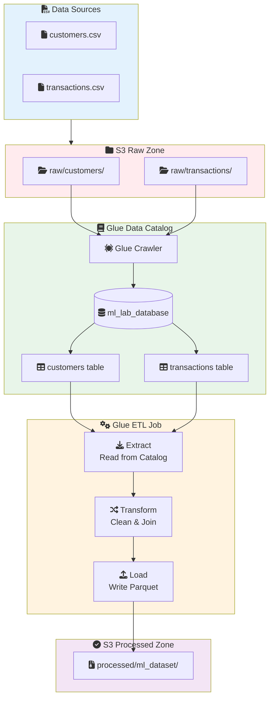
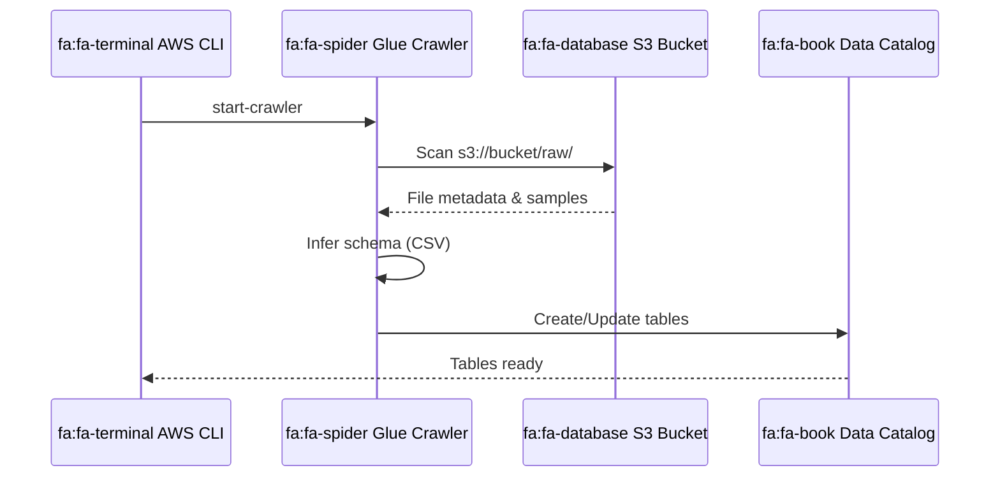
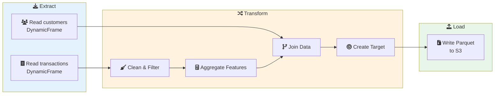

# Lab 03: AWS Glue ETL for ML Data Preparation

## Overview
In this lab, you'll use AWS Glue to catalog, transform, and prepare data for machine learning workflows.

**Duration**: 60-90 minutes
**Cost**: ~$2-5 (Glue charges per DPU-hour)
**Prerequisites**: Completed Lab 02 (S3 Data Lake)

---

## Architecture Overview



### Crawler Discovery Process



### ETL Job Data Flow



---

## Lab Objectives

By the end of this lab, you will be able to:
- [ ] Create a Glue database and crawl S3 data
- [ ] Explore data using Glue Data Catalog
- [ ] Create and run a Glue ETL job
- [ ] Transform data for ML training
- [ ] Use job bookmarks for incremental processing

---

## Part 1: Setup

### Step 1.1: Create S3 Buckets and Upload Sample Data

```bash
# Set variables
export BUCKET_NAME="glue-lab-$(date +%Y%m%d)-$RANDOM"
export REGION="us-east-1"

# Create bucket
aws s3 mb s3://$BUCKET_NAME --region $REGION

# Create folders
aws s3api put-object --bucket $BUCKET_NAME --key "raw/"
aws s3api put-object --bucket $BUCKET_NAME --key "processed/"
aws s3api put-object --bucket $BUCKET_NAME --key "scripts/"
```

### Step 1.2: Generate Sample Data

Create `generate_raw_data.py`:

```python
import pandas as pd
import numpy as np
from datetime import datetime, timedelta
import random

np.random.seed(42)

# Generate customer data
n_customers = 1000
customers = pd.DataFrame({
    'customer_id': range(1, n_customers + 1),
    'name': [f"Customer_{i}" for i in range(1, n_customers + 1)],
    'email': [f"customer{i}@example.com" for i in range(1, n_customers + 1)],
    'age': np.random.randint(18, 70, n_customers),
    'region': np.random.choice(['North', 'South', 'East', 'West'], n_customers),
    'signup_date': [(datetime(2023, 1, 1) + timedelta(days=random.randint(0, 365))).strftime('%Y-%m-%d')
                    for _ in range(n_customers)]
})

# Generate transactions data with some quality issues
n_transactions = 10000
transactions = pd.DataFrame({
    'transaction_id': range(1, n_transactions + 1),
    'customer_id': np.random.randint(1, n_customers + 1, n_transactions),
    'amount': np.random.uniform(10, 1000, n_transactions).round(2),
    'product_category': np.random.choice(['Electronics', 'Clothing', 'Food', 'Home', None], n_transactions),
    'transaction_date': [(datetime(2024, 1, 1) + timedelta(days=random.randint(0, 90))).strftime('%Y-%m-%d')
                         for _ in range(n_transactions)],
    'status': np.random.choice(['completed', 'pending', 'failed', 'COMPLETED', 'Completed'], n_transactions)
})

# Introduce data quality issues
transactions.loc[np.random.choice(n_transactions, 50, replace=False), 'amount'] = None
transactions.loc[np.random.choice(n_transactions, 30, replace=False), 'customer_id'] = -1

# Save to CSV
customers.to_csv('customers.csv', index=False)
transactions.to_csv('transactions.csv', index=False)

print(f"Generated {len(customers)} customers and {len(transactions)} transactions")
print(f"\nData quality issues in transactions:")
print(f"  - Null amounts: {transactions['amount'].isna().sum()}")
print(f"  - Invalid customer_id: {(transactions['customer_id'] == -1).sum()}")
print(f"  - Null categories: {transactions['product_category'].isna().sum()}")
```

```bash
# Generate and upload data
python generate_raw_data.py

aws s3 cp customers.csv s3://$BUCKET_NAME/raw/customers/
aws s3 cp transactions.csv s3://$BUCKET_NAME/raw/transactions/

echo "Data uploaded to S3"
```

---

## Part 2: Create Glue Database and Crawler

### Step 2.1: Create IAM Role for Glue

```bash
# Create trust policy
cat > glue-trust-policy.json << 'EOF'
{
    "Version": "2012-10-17",
    "Statement": [
        {
            "Effect": "Allow",
            "Principal": {
                "Service": "glue.amazonaws.com"
            },
            "Action": "sts:AssumeRole"
        }
    ]
}
EOF

# Create role
aws iam create-role \
    --role-name GlueLabRole \
    --assume-role-policy-document file://glue-trust-policy.json

# Attach policies
aws iam attach-role-policy \
    --role-name GlueLabRole \
    --policy-arn arn:aws:iam::aws:policy/service-role/AWSGlueServiceRole

aws iam attach-role-policy \
    --role-name GlueLabRole \
    --policy-arn arn:aws:iam::aws:policy/AmazonS3FullAccess

export GLUE_ROLE_ARN=$(aws iam get-role --role-name GlueLabRole --query 'Role.Arn' --output text)
echo "Glue Role ARN: $GLUE_ROLE_ARN"

# Wait for role propagation
sleep 10
```

### Step 2.2: Create Glue Database

```bash
# Create database
aws glue create-database \
    --database-input '{
        "Name": "ml_lab_database",
        "Description": "Database for ML lab data"
    }'

echo "Database 'ml_lab_database' created"
```

### Step 2.3: Create and Run Crawler

```bash
# Create crawler
aws glue create-crawler \
    --name ml-lab-crawler \
    --role $GLUE_ROLE_ARN \
    --database-name ml_lab_database \
    --targets '{
        "S3Targets": [
            {"Path": "s3://'$BUCKET_NAME'/raw/customers/"},
            {"Path": "s3://'$BUCKET_NAME'/raw/transactions/"}
        ]
    }' \
    --schema-change-policy '{
        "UpdateBehavior": "UPDATE_IN_DATABASE",
        "DeleteBehavior": "LOG"
    }'

# Start crawler
aws glue start-crawler --name ml-lab-crawler

echo "Crawler started. Waiting for completion..."

# Wait for crawler to complete
while true; do
    STATUS=$(aws glue get-crawler --name ml-lab-crawler --query 'Crawler.State' --output text)
    echo "Crawler status: $STATUS"
    if [ "$STATUS" = "READY" ]; then
        break
    fi
    sleep 15
done

echo "Crawler completed!"
```

### Step 2.4: Verify Tables in Data Catalog

```bash
# List tables
aws glue get-tables --database-name ml_lab_database --query 'TableList[].Name'

# Get table details
aws glue get-table --database-name ml_lab_database --name customers
aws glue get-table --database-name ml_lab_database --name transactions
```

---

## Part 3: Create Glue ETL Job

### Step 3.1: Create ETL Script

Create `glue_etl_script.py`:

```python
"""
Glue ETL Job: Transform raw data for ML training

This job:
1. Reads raw customer and transaction data
2. Cleans and validates data
3. Joins datasets
4. Creates features for ML
5. Writes to processed location in Parquet format
"""

import sys
from awsglue.transforms import *
from awsglue.utils import getResolvedOptions
from pyspark.context import SparkContext
from awsglue.context import GlueContext
from awsglue.job import Job
from awsglue.dynamicframe import DynamicFrame
from pyspark.sql.functions import (
    col, when, lower, trim, coalesce, lit,
    datediff, current_date, count, sum as spark_sum, avg
)

# Get job arguments
args = getResolvedOptions(sys.argv, ['JOB_NAME', 'source_bucket', 'target_bucket'])

# Initialize contexts
sc = SparkContext()
glueContext = GlueContext(sc)
spark = glueContext.spark_session
job = Job(glueContext)
job.init(args['JOB_NAME'], args)

source_bucket = args['source_bucket']
target_bucket = args['target_bucket']

print(f"Source bucket: {source_bucket}")
print(f"Target bucket: {target_bucket}")

# ============================================================================
# EXTRACT: Read from Data Catalog
# ============================================================================

print("Reading data from Data Catalog...")

customers_dyf = glueContext.create_dynamic_frame.from_catalog(
    database="ml_lab_database",
    table_name="customers",
    transformation_ctx="customers_dyf"
)

transactions_dyf = glueContext.create_dynamic_frame.from_catalog(
    database="ml_lab_database",
    table_name="transactions",
    transformation_ctx="transactions_dyf"
)

print(f"Customers count: {customers_dyf.count()}")
print(f"Transactions count: {transactions_dyf.count()}")

# ============================================================================
# TRANSFORM: Clean and prepare data
# ============================================================================

# Convert to DataFrames for complex transformations
customers_df = customers_dyf.toDF()
transactions_df = transactions_dyf.toDF()

# ----- Clean Transactions -----
print("Cleaning transactions...")

# 1. Standardize status column
transactions_df = transactions_df.withColumn(
    "status_clean",
    lower(trim(col("status")))
)

# 2. Filter invalid records
transactions_df = transactions_df.filter(
    (col("customer_id") > 0) &
    (col("amount").isNotNull()) &
    (col("amount") > 0)
)

# 3. Fill null categories
transactions_df = transactions_df.withColumn(
    "product_category_clean",
    coalesce(col("product_category"), lit("Unknown"))
)

print(f"Transactions after cleaning: {transactions_df.count()}")

# ----- Create Customer Features -----
print("Creating customer features...")

# Aggregate transaction features per customer
customer_features = transactions_df.groupBy("customer_id").agg(
    count("transaction_id").alias("total_transactions"),
    spark_sum("amount").alias("total_spend"),
    avg("amount").alias("avg_transaction_amount"),
    count(when(col("status_clean") == "completed", 1)).alias("completed_transactions"),
    count(when(col("product_category_clean") == "Electronics", 1)).alias("electronics_purchases")
)

# Join with customer demographics
ml_dataset = customers_df.join(
    customer_features,
    customers_df.customer_id == customer_features.customer_id,
    "left"
).drop(customer_features.customer_id)

# Fill nulls for customers with no transactions
ml_dataset = ml_dataset.fillna({
    "total_transactions": 0,
    "total_spend": 0.0,
    "avg_transaction_amount": 0.0,
    "completed_transactions": 0,
    "electronics_purchases": 0
})

# Calculate days since signup
ml_dataset = ml_dataset.withColumn(
    "days_since_signup",
    datediff(current_date(), col("signup_date"))
)

# Create target variable (high value customer: spend > 500)
ml_dataset = ml_dataset.withColumn(
    "is_high_value",
    when(col("total_spend") > 500, 1).otherwise(0)
)

# Select final columns
final_columns = [
    "customer_id", "age", "region", "days_since_signup",
    "total_transactions", "total_spend", "avg_transaction_amount",
    "completed_transactions", "electronics_purchases", "is_high_value"
]

ml_dataset = ml_dataset.select(final_columns)

print(f"Final dataset records: {ml_dataset.count()}")
print(f"High value customers: {ml_dataset.filter(col('is_high_value') == 1).count()}")

# ============================================================================
# LOAD: Write to S3 in Parquet format
# ============================================================================

print("Writing processed data...")

# Convert back to DynamicFrame
output_dyf = DynamicFrame.fromDF(ml_dataset, glueContext, "output")

# Write to S3
glueContext.write_dynamic_frame.from_options(
    frame=output_dyf,
    connection_type="s3",
    connection_options={
        "path": f"s3://{target_bucket}/processed/ml_dataset/"
    },
    format="parquet",
    format_options={
        "compression": "snappy"
    },
    transformation_ctx="output"
)

print("ETL job completed successfully!")

# Commit job (for bookmarks)
job.commit()
```

### Step 3.2: Upload Script to S3

```bash
aws s3 cp glue_etl_script.py s3://$BUCKET_NAME/scripts/

echo "Script uploaded"
```

### Step 3.3: Create Glue Job

```bash
aws glue create-job \
    --name ml-data-prep-job \
    --role $GLUE_ROLE_ARN \
    --command '{
        "Name": "glueetl",
        "ScriptLocation": "s3://'$BUCKET_NAME'/scripts/glue_etl_script.py",
        "PythonVersion": "3"
    }' \
    --default-arguments '{
        "--source_bucket": "'$BUCKET_NAME'",
        "--target_bucket": "'$BUCKET_NAME'",
        "--job-bookmark-option": "job-bookmark-enable",
        "--enable-metrics": "true",
        "--enable-continuous-cloudwatch-log": "true"
    }' \
    --glue-version "4.0" \
    --number-of-workers 2 \
    --worker-type "G.1X"

echo "Job created"
```

### Step 3.4: Run the Job

```bash
# Start job run
RUN_ID=$(aws glue start-job-run \
    --job-name ml-data-prep-job \
    --query 'JobRunId' \
    --output text)

echo "Job run started: $RUN_ID"

# Monitor job status
while true; do
    STATUS=$(aws glue get-job-run \
        --job-name ml-data-prep-job \
        --run-id $RUN_ID \
        --query 'JobRun.JobRunState' \
        --output text)

    echo "Job status: $STATUS"

    if [ "$STATUS" = "SUCCEEDED" ] || [ "$STATUS" = "FAILED" ] || [ "$STATUS" = "STOPPED" ]; then
        break
    fi

    sleep 30
done

# Get job run details
aws glue get-job-run \
    --job-name ml-data-prep-job \
    --run-id $RUN_ID
```

---

## Part 4: Verify Output

### Step 4.1: Check Processed Data

```bash
# List output files
aws s3 ls s3://$BUCKET_NAME/processed/ml_dataset/ --recursive

# Download and inspect
aws s3 cp s3://$BUCKET_NAME/processed/ml_dataset/ ./output/ --recursive
```

### Step 4.2: Inspect with Python

```python
import pandas as pd

# Read Parquet files
df = pd.read_parquet('./output/')
print(f"Records: {len(df)}")
print(f"\nColumns: {df.columns.tolist()}")
print(f"\nSample data:\n{df.head()}")
print(f"\nStatistics:\n{df.describe()}")
print(f"\nTarget distribution:\n{df['is_high_value'].value_counts()}")
```

---

## Part 5: Create a Crawler for Processed Data

```bash
# Create crawler for processed data
aws glue create-crawler \
    --name ml-processed-crawler \
    --role $GLUE_ROLE_ARN \
    --database-name ml_lab_database \
    --targets '{
        "S3Targets": [
            {"Path": "s3://'$BUCKET_NAME'/processed/ml_dataset/"}
        ]
    }'

# Run crawler
aws glue start-crawler --name ml-processed-crawler

echo "Crawler started for processed data"
```

---

## Part 6: Clean Up

```bash
# Delete jobs
aws glue delete-job --job-name ml-data-prep-job

# Delete crawlers
aws glue delete-crawler --name ml-lab-crawler
aws glue delete-crawler --name ml-processed-crawler

# Delete database (deletes all tables too)
aws glue delete-database --name ml_lab_database

# Delete IAM role
aws iam detach-role-policy --role-name GlueLabRole --policy-arn arn:aws:iam::aws:policy/service-role/AWSGlueServiceRole
aws iam detach-role-policy --role-name GlueLabRole --policy-arn arn:aws:iam::aws:policy/AmazonS3FullAccess
aws iam delete-role --role-name GlueLabRole

# Delete S3 bucket
aws s3 rm s3://$BUCKET_NAME --recursive
aws s3 rb s3://$BUCKET_NAME

# Clean local files
rm -rf customers.csv transactions.csv glue_etl_script.py output/ *.json

echo "Cleanup complete"
```

---

## Lab Challenges

### Challenge 1: Add Data Quality Checks
Add Glue Data Quality rules to validate the output data.

### Challenge 2: Incremental Processing
Add new data and observe job bookmarks processing only new records.

### Challenge 3: Partitioned Output
Modify the job to output data partitioned by region.

---

## Lab Summary

| Concept | What You Did |
|---------|--------------|
| **Data Catalog** | Created database, ran crawlers to catalog S3 data |
| **ETL Job** | Created PySpark job to clean and transform data |
| **Data Cleaning** | Handled nulls, standardized values, filtered invalid |
| **Feature Engineering** | Created aggregated customer features |
| **Output** | Wrote Parquet files to S3 |

---

## Exam Relevance

- ✅ Glue crawlers and Data Catalog
- ✅ DynamicFrame vs DataFrame transformations
- ✅ Job bookmarks for incremental processing
- ✅ Data cleaning and feature engineering
- ✅ Output formats (Parquet) and partitioning

---

## Next Lab

Continue to [Lab 04: SageMaker Feature Store](../04-feature-store/LAB.md) →
