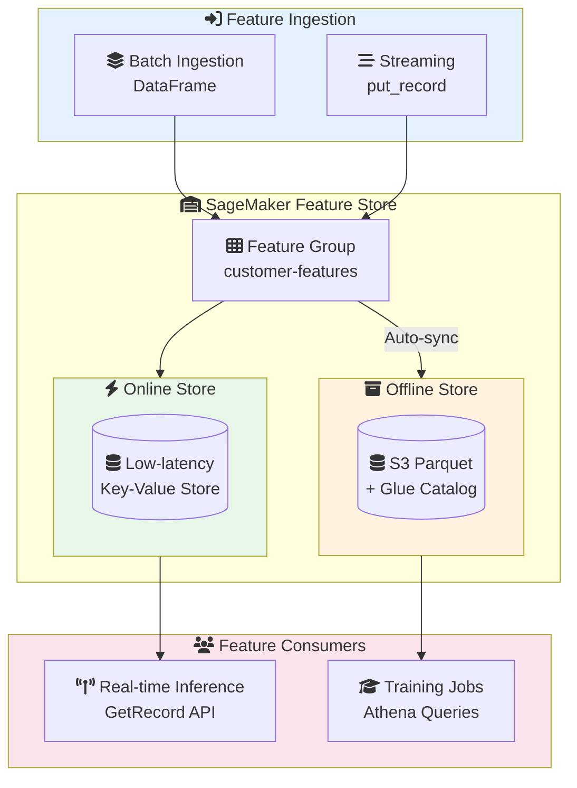
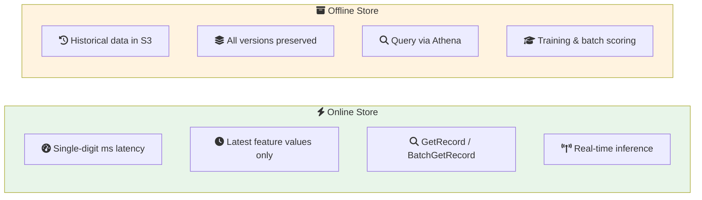
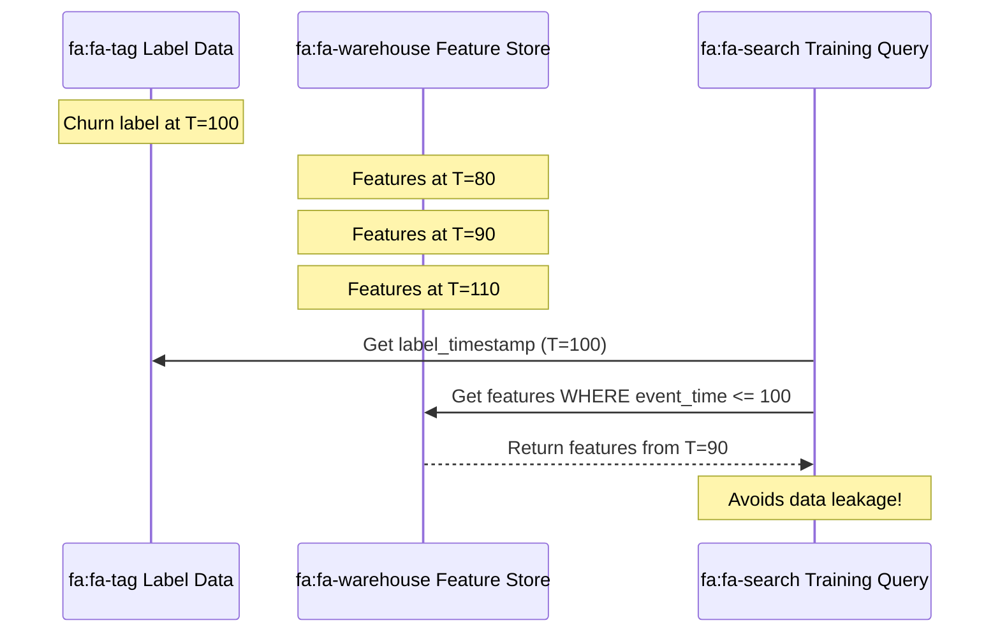

# Lab 04: SageMaker Feature Store

## Overview
In this lab, you'll create and use a SageMaker Feature Store for managing ML features, including both online (real-time) and offline (batch) access patterns.

**Duration**: 60-90 minutes
**Cost**: ~$2-5
**Prerequisites**: AWS Account with SageMaker permissions

---

## Architecture Overview



### Online vs Offline Store



### Point-in-Time Query



---

## Lab Objectives

By the end of this lab, you will be able to:
- [ ] Create a Feature Group with online and offline stores
- [ ] Ingest features from a DataFrame
- [ ] Query online store for real-time inference
- [ ] Query offline store using Athena
- [ ] Understand point-in-time queries

---

## Part 1: Environment Setup

### Step 1.1: Open SageMaker Studio or Notebook

Option A: Use SageMaker Studio (recommended)
Option B: Use the notebook instance from Lab 01

### Step 1.2: Setup Notebook

```python
# Cell 1: Install and import libraries
!pip install -q sagemaker --upgrade

import sagemaker
import boto3
import pandas as pd
import numpy as np
from sagemaker.feature_store.feature_group import FeatureGroup
from sagemaker.feature_store.feature_definition import (
    FeatureDefinition,
    FeatureTypeEnum
)
import time
from datetime import datetime, timedelta

# Initialize session
session = sagemaker.Session()
role = sagemaker.get_execution_role()
region = session.boto_region_name
bucket = session.default_bucket()

print(f"Role: {role}")
print(f"Bucket: {bucket}")
print(f"Region: {region}")
```

---

## Part 2: Create Feature Group

### Step 2.1: Define Feature Definitions

```python
# Cell 2: Define schema for customer features
# IMPORTANT: Only 3 types - STRING, INTEGRAL, FRACTIONAL

feature_group_name = f"customer-features-{int(time.time())}"

feature_definitions = [
    # Required: Record identifier (primary key)
    FeatureDefinition(
        feature_name="customer_id",
        feature_type=FeatureTypeEnum.STRING
    ),
    # Required: Event time (for versioning)
    FeatureDefinition(
        feature_name="event_time",
        feature_type=FeatureTypeEnum.FRACTIONAL
    ),
    # Customer demographics
    FeatureDefinition(
        feature_name="age",
        feature_type=FeatureTypeEnum.INTEGRAL
    ),
    FeatureDefinition(
        feature_name="tenure_days",
        feature_type=FeatureTypeEnum.INTEGRAL
    ),
    # Behavioral features
    FeatureDefinition(
        feature_name="total_purchases",
        feature_type=FeatureTypeEnum.INTEGRAL
    ),
    FeatureDefinition(
        feature_name="total_spend",
        feature_type=FeatureTypeEnum.FRACTIONAL
    ),
    FeatureDefinition(
        feature_name="avg_order_value",
        feature_type=FeatureTypeEnum.FRACTIONAL
    ),
    FeatureDefinition(
        feature_name="days_since_last_purchase",
        feature_type=FeatureTypeEnum.INTEGRAL
    ),
    # Derived features
    FeatureDefinition(
        feature_name="customer_segment",
        feature_type=FeatureTypeEnum.STRING
    ),
    FeatureDefinition(
        feature_name="churn_risk_score",
        feature_type=FeatureTypeEnum.FRACTIONAL
    )
]

print(f"Feature group name: {feature_group_name}")
print(f"Number of features: {len(feature_definitions)}")
```

### Step 2.2: Create Feature Group

```python
# Cell 3: Create feature group
feature_group = FeatureGroup(
    name=feature_group_name,
    sagemaker_session=session,
    feature_definitions=feature_definitions
)

# Create with both online and offline stores
feature_group.create(
    s3_uri=f"s3://{bucket}/feature-store/{feature_group_name}/",
    record_identifier_name="customer_id",
    event_time_feature_name="event_time",
    role_arn=role,
    enable_online_store=True,  # For real-time inference
    description="Customer features for churn prediction",
    tags=[
        {"Key": "Project", "Value": "MLLab"},
        {"Key": "Environment", "Value": "Development"}
    ]
)

print("Creating feature group...")

# Wait for feature group to be created
status = ""
while status != "Created":
    status = feature_group.describe().get("FeatureGroupStatus")
    print(f"Status: {status}")
    if status == "CreateFailed":
        raise Exception("Feature group creation failed!")
    time.sleep(5)

print(f"\nFeature group '{feature_group_name}' created successfully!")
```

### Step 2.3: Verify Feature Group

```python
# Cell 4: Describe feature group
description = feature_group.describe()

print("Feature Group Details:")
print(f"  Name: {description['FeatureGroupName']}")
print(f"  ARN: {description['FeatureGroupArn']}")
print(f"  Status: {description['FeatureGroupStatus']}")
print(f"  Online Store: {description.get('OnlineStoreConfig', {}).get('EnableOnlineStore')}")
print(f"  Offline Store: s3://{bucket}/feature-store/{feature_group_name}/")
print(f"\nFeatures:")
for feat in description['FeatureDefinitions']:
    print(f"  - {feat['FeatureName']}: {feat['FeatureType']}")
```

---

## Part 3: Ingest Features

### Step 3.1: Generate Sample Feature Data

```python
# Cell 5: Generate sample customer features
np.random.seed(42)
n_customers = 100

# Current timestamp
current_time = time.time()

# Generate feature data
data = {
    "customer_id": [f"CUST_{i:05d}" for i in range(n_customers)],
    "event_time": [current_time] * n_customers,
    "age": np.random.randint(18, 70, n_customers),
    "tenure_days": np.random.randint(30, 1000, n_customers),
    "total_purchases": np.random.randint(1, 100, n_customers),
    "total_spend": np.random.uniform(50, 5000, n_customers).round(2),
    "avg_order_value": np.random.uniform(20, 200, n_customers).round(2),
    "days_since_last_purchase": np.random.randint(0, 90, n_customers),
    "customer_segment": np.random.choice(["bronze", "silver", "gold", "platinum"], n_customers),
    "churn_risk_score": np.random.uniform(0, 1, n_customers).round(4)
}

df = pd.DataFrame(data)
print(f"Generated {len(df)} customer records")
df.head()
```

### Step 3.2: Ingest Features

```python
# Cell 6: Ingest features into Feature Store
print("Ingesting features...")
start_time = time.time()

# Batch ingest from DataFrame
feature_group.ingest(
    data_frame=df,
    max_workers=3,
    wait=True
)

elapsed = time.time() - start_time
print(f"Ingestion completed in {elapsed:.2f} seconds")
print(f"Records ingested: {len(df)}")
```

### Step 3.3: Verify Ingestion

```python
# Cell 7: Wait for data to be available in online store
print("Waiting for data to be available in online store...")
time.sleep(10)

# Test retrieval
test_customer_id = "CUST_00000"
record = feature_group.get_record(
    record_identifier_value_as_string=test_customer_id
)

print(f"\nRetrieved record for {test_customer_id}:")
for feature in record['Record']:
    print(f"  {feature['FeatureName']}: {feature['ValueAsString']}")
```

---

## Part 4: Query Online Store

### Step 4.1: Single Record Lookup

```python
# Cell 8: Real-time feature retrieval (for inference)
def get_customer_features(customer_id):
    """
    Get features for a single customer.
    Used during real-time inference.
    """
    record = feature_group.get_record(
        record_identifier_value_as_string=customer_id
    )

    # Convert to dictionary
    features = {
        r['FeatureName']: r['ValueAsString']
        for r in record['Record']
    }

    return features

# Test
features = get_customer_features("CUST_00010")
print("Features for CUST_00010:")
for k, v in features.items():
    print(f"  {k}: {v}")
```

### Step 4.2: Batch Record Lookup

```python
# Cell 9: Batch get for multiple customers
from sagemaker.feature_store.feature_store import FeatureStore
from sagemaker.feature_store.inputs import Identifier

feature_store = FeatureStore(sagemaker_session=session)

# Get multiple customer IDs
customer_ids = ["CUST_00001", "CUST_00002", "CUST_00003"]

identifiers = [
    Identifier(
        feature_group_name=feature_group_name,
        record_identifiers_value_as_string=[cid]
    )
    for cid in customer_ids
]

# Batch get
response = feature_store.batch_get_record(identifiers=identifiers)

print("Batch get results:")
for record in response['Records']:
    customer_id = None
    for feature in record['Record']:
        if feature['FeatureName'] == 'customer_id':
            customer_id = feature['ValueAsString']
            break
    print(f"  Retrieved: {customer_id}")
```

---

## Part 5: Query Offline Store

### Step 5.1: Wait for Offline Store Sync

```python
# Cell 10: Offline store takes a few minutes to sync
print("Waiting for offline store to sync (this may take 5-10 minutes)...")
print("The offline store automatically syncs data from online store to S3 in Parquet format.")

# Check S3 for data
s3 = boto3.client('s3')
prefix = f"feature-store/{feature_group_name}/"

# Wait and check
for i in range(20):  # Wait up to 10 minutes
    response = s3.list_objects_v2(
        Bucket=bucket,
        Prefix=prefix
    )

    if 'Contents' in response:
        parquet_files = [obj for obj in response['Contents'] if obj['Key'].endswith('.parquet')]
        if parquet_files:
            print(f"\nOffline store data available!")
            print(f"Found {len(parquet_files)} Parquet file(s)")
            break

    print(f"Waiting... ({(i+1)*30} seconds)")
    time.sleep(30)
else:
    print("\nNote: Offline store sync may still be in progress.")
    print("You can continue with the lab and check back later.")
```

### Step 5.2: Query with Athena

```python
# Cell 11: Query offline store using Athena
query = feature_group.athena_query()

# Build query
query_string = f"""
SELECT
    customer_id,
    age,
    total_purchases,
    total_spend,
    customer_segment,
    churn_risk_score,
    event_time
FROM "sagemaker_featurestore"."{feature_group_name.replace('-', '_')}"
WHERE churn_risk_score > 0.5
ORDER BY churn_risk_score DESC
LIMIT 10
"""

print("Running Athena query...")
print(query_string)

# Run query
query.run(
    query_string=query_string,
    output_location=f"s3://{bucket}/athena-results/"
)

# Wait for query to complete
query.wait()

# Get results
df_results = query.as_dataframe()
print(f"\nHigh churn risk customers:")
df_results
```

### Step 5.3: Aggregate Query

```python
# Cell 12: Aggregate analysis
aggregate_query = f"""
SELECT
    customer_segment,
    COUNT(*) as customer_count,
    AVG(total_spend) as avg_spend,
    AVG(churn_risk_score) as avg_churn_risk
FROM "sagemaker_featurestore"."{feature_group_name.replace('-', '_')}"
GROUP BY customer_segment
ORDER BY avg_spend DESC
"""

query2 = feature_group.athena_query()
query2.run(
    query_string=aggregate_query,
    output_location=f"s3://{bucket}/athena-results/"
)
query2.wait()

df_agg = query2.as_dataframe()
print("Customer Segment Analysis:")
df_agg
```

---

## Part 6: Update Features (Streaming)

### Step 6.1: Update a Customer's Features

```python
# Cell 13: Update features for a customer (simulating new activity)
updated_customer = "CUST_00001"

# New feature values
new_record = [
    {"FeatureName": "customer_id", "ValueAsString": updated_customer},
    {"FeatureName": "event_time", "ValueAsString": str(time.time())},
    {"FeatureName": "age", "ValueAsString": "35"},
    {"FeatureName": "tenure_days", "ValueAsString": "400"},
    {"FeatureName": "total_purchases", "ValueAsString": "55"},  # Increased
    {"FeatureName": "total_spend", "ValueAsString": "2500.00"},  # Increased
    {"FeatureName": "avg_order_value", "ValueAsString": "45.45"},
    {"FeatureName": "days_since_last_purchase", "ValueAsString": "2"},  # Recent purchase
    {"FeatureName": "customer_segment", "ValueAsString": "gold"},  # Upgraded
    {"FeatureName": "churn_risk_score", "ValueAsString": "0.15"}  # Lower risk
]

# Put record
feature_group.put_record(record=new_record)
print(f"Updated features for {updated_customer}")

# Verify update (wait a moment for propagation)
time.sleep(5)
updated_record = feature_group.get_record(
    record_identifier_value_as_string=updated_customer
)

print("\nUpdated record:")
for feature in updated_record['Record']:
    print(f"  {feature['FeatureName']}: {feature['ValueAsString']}")
```

---

## Part 7: Point-in-Time Query (Conceptual)

```python
# Cell 14: Understanding point-in-time queries
"""
Point-in-time queries are crucial for ML training to avoid data leakage.

Example scenario:
- Label: Did customer churn? (Known at time T)
- Features: Must be from BEFORE time T

Wrong: Using features from after the label time (data leakage)
Right: Using features as they were known before the label time

In Feature Store:
- event_time tracks when features were valid
- Point-in-time queries retrieve features <= label_timestamp
"""

# Example point-in-time query structure
point_in_time_query = """
-- This query gets features as they were known at label time
SELECT
    labels.customer_id,
    labels.churn_label,
    labels.label_timestamp,
    features.total_purchases,
    features.total_spend,
    features.churn_risk_score
FROM labels
LEFT JOIN (
    SELECT *,
        ROW_NUMBER() OVER (
            PARTITION BY customer_id
            ORDER BY event_time DESC
        ) as rn
    FROM "sagemaker_featurestore"."{feature_group}"
    WHERE event_time <= labels.label_timestamp
) features
ON labels.customer_id = features.customer_id
WHERE features.rn = 1
"""

print("Point-in-Time Query Pattern:")
print(point_in_time_query)
```

---

## Part 8: Clean Up

```python
# Cell 15: Delete feature group and clean up
print("Cleaning up resources...")

# Delete feature group
feature_group.delete()
print(f"Feature group '{feature_group_name}' deleted")

# Clean up S3 data
s3 = boto3.client('s3')

# Delete feature store data
prefix = f"feature-store/{feature_group_name}/"
response = s3.list_objects_v2(Bucket=bucket, Prefix=prefix)
if 'Contents' in response:
    for obj in response['Contents']:
        s3.delete_object(Bucket=bucket, Key=obj['Key'])
    print(f"Deleted S3 data: s3://{bucket}/{prefix}")

# Delete Athena results
athena_prefix = "athena-results/"
response = s3.list_objects_v2(Bucket=bucket, Prefix=athena_prefix)
if 'Contents' in response:
    for obj in response['Contents']:
        s3.delete_object(Bucket=bucket, Key=obj['Key'])
    print(f"Deleted Athena results")

print("\nCleanup complete!")
```

---

## Lab Challenges

### Challenge 1: Add TTL Configuration
Create a feature group with Time-to-Live (TTL) for online store records.

<details>
<summary>Hint</summary>

```python
from sagemaker.feature_store.inputs import OnlineStoreConfig, TtlDuration

online_config = OnlineStoreConfig(
    enable_online_store=True,
    ttl_duration=TtlDuration(unit="Days", value=90)
)
```
</details>

### Challenge 2: Offline-Only Feature Group
Create a feature group with only offline store (for training-only features).

### Challenge 3: Feature Store + SageMaker Training
Create a training job that reads from Feature Store offline store.

---

## Lab Summary

| Concept | What You Did |
|---------|--------------|
| **Feature Group Creation** | Created with online + offline stores |
| **Ingestion** | Batch ingested features from DataFrame |
| **Online Store** | Queried for real-time inference |
| **Offline Store** | Queried with Athena for training data |
| **Updates** | Updated features for a customer |
| **Point-in-Time** | Understood pattern for training data |

---

## Exam Relevance

- ✅ Online vs Offline store use cases
- ✅ Record identifier and event time requirements
- ✅ Ingestion patterns (batch, streaming)
- ✅ Query patterns (GetRecord, Athena)
- ✅ Point-in-time correctness for training

---

## Next Lab

Continue to [Lab 05: SageMaker Pipelines](../05-sagemaker-pipelines/LAB.md) →
