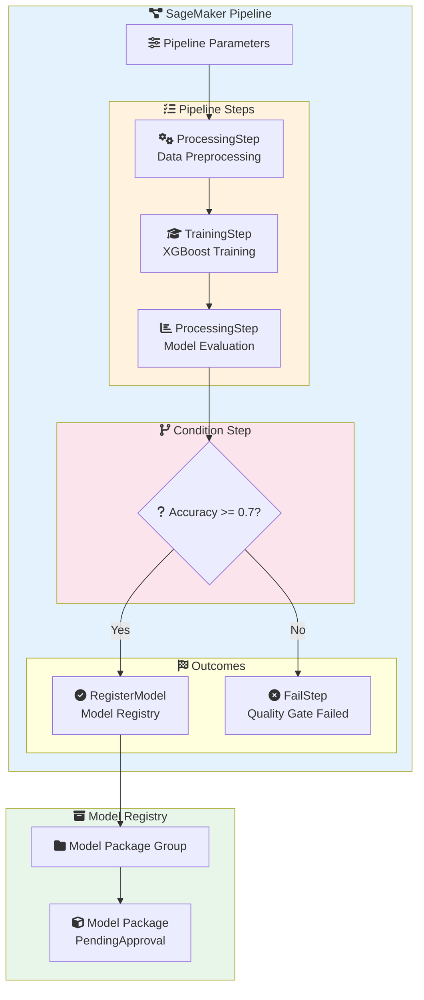
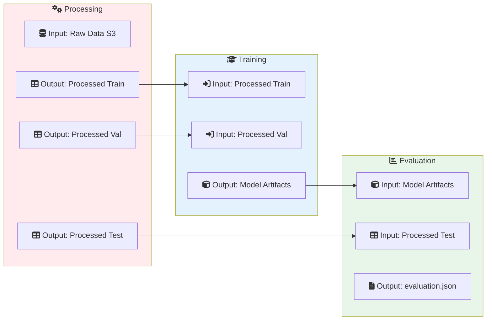
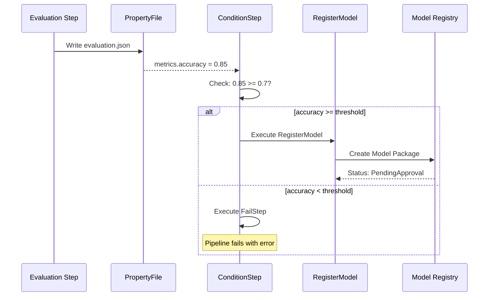

# Lab 05: SageMaker Pipelines - ML CI/CD

## Overview
In this lab, you'll build an automated ML pipeline that includes data processing, model training, evaluation, and conditional model registration.

**Duration**: 90-120 minutes
**Cost**: ~$5-10
**Prerequisites**: Completed Labs 01-04

---

## Architecture Overview



### Step Dependencies



### Conditional Model Registration



---

## Lab Objectives

By the end of this lab, you will be able to:
- [ ] Create pipeline steps (Processing, Training, Evaluation)
- [ ] Use pipeline parameters for flexibility
- [ ] Implement conditional logic with ConditionStep
- [ ] Register models in Model Registry
- [ ] Execute and monitor pipelines

---

## Part 1: Environment Setup

### Step 1.1: Setup Notebook

```python
# Cell 1: Import libraries
import sagemaker
import boto3
import json
from sagemaker.workflow.pipeline import Pipeline
from sagemaker.workflow.steps import ProcessingStep, TrainingStep
from sagemaker.workflow.step_collections import RegisterModel
from sagemaker.workflow.conditions import ConditionGreaterThanOrEqualTo
from sagemaker.workflow.condition_step import ConditionStep
from sagemaker.workflow.functions import JsonGet
from sagemaker.workflow.properties import PropertyFile
from sagemaker.workflow.parameters import (
    ParameterInteger,
    ParameterString,
    ParameterFloat
)
from sagemaker.workflow.fail_step import FailStep
from sagemaker.processing import ScriptProcessor, ProcessingInput, ProcessingOutput
from sagemaker.estimator import Estimator
from sagemaker.inputs import TrainingInput
from sagemaker.workflow.steps import CacheConfig

session = sagemaker.Session()
role = sagemaker.get_execution_role()
bucket = session.default_bucket()
region = session.boto_region_name
prefix = "pipeline-lab"

print(f"Role: {role}")
print(f"Bucket: {bucket}")
```

### Step 1.2: Upload Sample Data

```python
# Cell 2: Generate and upload training data
import pandas as pd
import numpy as np
from sklearn.datasets import make_classification

np.random.seed(42)
X, y = make_classification(n_samples=5000, n_features=20, n_informative=15,
                           n_redundant=5, n_classes=2, random_state=42)

# Create DataFrame with target first (SageMaker convention)
columns = ['target'] + [f'feature_{i}' for i in range(20)]
data = np.column_stack([y, X])
df = pd.DataFrame(data, columns=columns)

# Split data
from sklearn.model_selection import train_test_split
train_df, temp_df = train_test_split(df, test_size=0.3, random_state=42)
val_df, test_df = train_test_split(temp_df, test_size=0.5, random_state=42)

# Save and upload
train_df.to_csv('train.csv', index=False, header=False)
val_df.to_csv('validation.csv', index=False, header=False)
test_df.to_csv('test.csv', index=False, header=False)

train_uri = session.upload_data('train.csv', bucket=bucket, key_prefix=f'{prefix}/data/train')
val_uri = session.upload_data('validation.csv', bucket=bucket, key_prefix=f'{prefix}/data/validation')
test_uri = session.upload_data('test.csv', bucket=bucket, key_prefix=f'{prefix}/data/test')

print(f"Training data: {train_uri}")
print(f"Validation data: {val_uri}")
print(f"Test data: {test_uri}")
```

---

## Part 2: Define Pipeline Parameters

```python
# Cell 3: Define parameters for flexibility
# These can be changed at pipeline execution time

processing_instance_type = ParameterString(
    name="ProcessingInstanceType",
    default_value="ml.m5.large"
)

training_instance_type = ParameterString(
    name="TrainingInstanceType",
    default_value="ml.m5.large"
)

model_approval_status = ParameterString(
    name="ModelApprovalStatus",
    default_value="PendingManualApproval"
)

# Threshold for model quality gate
accuracy_threshold = ParameterFloat(
    name="AccuracyThreshold",
    default_value=0.7
)

# Input data location
input_data = ParameterString(
    name="InputData",
    default_value=f"s3://{bucket}/{prefix}/data/"
)

print("Parameters defined:")
print(f"  - ProcessingInstanceType: {processing_instance_type.default_value}")
print(f"  - TrainingInstanceType: {training_instance_type.default_value}")
print(f"  - AccuracyThreshold: {accuracy_threshold.default_value}")
```

---

## Part 3: Create Processing Step

### Step 3.1: Write Processing Script

```python
# Cell 4: Create preprocessing script
preprocessing_script = """
import os
import argparse
import pandas as pd
import numpy as np
from sklearn.preprocessing import StandardScaler
import joblib

def main():
    parser = argparse.ArgumentParser()
    parser.add_argument('--train-ratio', type=float, default=0.8)
    args = parser.parse_args()

    # Read input data
    input_path = '/opt/ml/processing/input'
    output_path = '/opt/ml/processing/output'

    # Load all CSV files
    train_data = pd.read_csv(f'{input_path}/train/train.csv', header=None)
    val_data = pd.read_csv(f'{input_path}/validation/validation.csv', header=None)
    test_data = pd.read_csv(f'{input_path}/test/test.csv', header=None)

    print(f"Train shape: {train_data.shape}")
    print(f"Validation shape: {val_data.shape}")
    print(f"Test shape: {test_data.shape}")

    # Target is first column, features are rest
    X_train = train_data.iloc[:, 1:].values
    y_train = train_data.iloc[:, 0].values

    X_val = val_data.iloc[:, 1:].values
    y_val = val_data.iloc[:, 0].values

    X_test = test_data.iloc[:, 1:].values
    y_test = test_data.iloc[:, 0].values

    # Scale features
    scaler = StandardScaler()
    X_train_scaled = scaler.fit_transform(X_train)
    X_val_scaled = scaler.transform(X_val)
    X_test_scaled = scaler.transform(X_test)

    # Save processed data (target first)
    train_processed = np.column_stack([y_train, X_train_scaled])
    val_processed = np.column_stack([y_val, X_val_scaled])
    test_processed = np.column_stack([y_test, X_test_scaled])

    os.makedirs(f'{output_path}/train', exist_ok=True)
    os.makedirs(f'{output_path}/validation', exist_ok=True)
    os.makedirs(f'{output_path}/test', exist_ok=True)

    pd.DataFrame(train_processed).to_csv(
        f'{output_path}/train/train.csv', index=False, header=False
    )
    pd.DataFrame(val_processed).to_csv(
        f'{output_path}/validation/validation.csv', index=False, header=False
    )
    pd.DataFrame(test_processed).to_csv(
        f'{output_path}/test/test.csv', index=False, header=False
    )

    # Save scaler for inference
    joblib.dump(scaler, f'{output_path}/model/scaler.joblib')

    print("Preprocessing complete!")

if __name__ == '__main__':
    main()
"""

# Save script
with open('preprocessing.py', 'w') as f:
    f.write(preprocessing_script)

# Upload to S3
preprocessing_uri = session.upload_data(
    'preprocessing.py', bucket=bucket, key_prefix=f'{prefix}/scripts'
)
print(f"Preprocessing script: {preprocessing_uri}")
```

### Step 3.2: Create Processing Step

```python
# Cell 5: Create processing step
from sagemaker.sklearn.processing import SKLearnProcessor

sklearn_processor = SKLearnProcessor(
    framework_version='1.0-1',
    role=role,
    instance_type=processing_instance_type,
    instance_count=1,
    sagemaker_session=session
)

processing_step = ProcessingStep(
    name="DataProcessing",
    processor=sklearn_processor,
    inputs=[
        ProcessingInput(
            source=f"s3://{bucket}/{prefix}/data/train/",
            destination="/opt/ml/processing/input/train"
        ),
        ProcessingInput(
            source=f"s3://{bucket}/{prefix}/data/validation/",
            destination="/opt/ml/processing/input/validation"
        ),
        ProcessingInput(
            source=f"s3://{bucket}/{prefix}/data/test/",
            destination="/opt/ml/processing/input/test"
        )
    ],
    outputs=[
        ProcessingOutput(
            output_name="train",
            source="/opt/ml/processing/output/train",
            destination=f"s3://{bucket}/{prefix}/processed/train"
        ),
        ProcessingOutput(
            output_name="validation",
            source="/opt/ml/processing/output/validation",
            destination=f"s3://{bucket}/{prefix}/processed/validation"
        ),
        ProcessingOutput(
            output_name="test",
            source="/opt/ml/processing/output/test",
            destination=f"s3://{bucket}/{prefix}/processed/test"
        ),
        ProcessingOutput(
            output_name="model",
            source="/opt/ml/processing/output/model",
            destination=f"s3://{bucket}/{prefix}/processed/model"
        )
    ],
    code=preprocessing_uri,
    cache_config=CacheConfig(enable_caching=True, expire_after="P7D")
)

print("Processing step created")
```

---

## Part 4: Create Training Step

```python
# Cell 6: Create training step
xgboost_image = sagemaker.image_uris.retrieve(
    framework='xgboost',
    region=region,
    version='1.5-1'
)

estimator = Estimator(
    image_uri=xgboost_image,
    role=role,
    instance_count=1,
    instance_type=training_instance_type,
    output_path=f"s3://{bucket}/{prefix}/models/",
    sagemaker_session=session,
    hyperparameters={
        'objective': 'binary:logistic',
        'num_round': 100,
        'max_depth': 5,
        'eta': 0.2,
        'eval_metric': 'auc'
    }
)

training_step = TrainingStep(
    name="ModelTraining",
    estimator=estimator,
    inputs={
        "train": TrainingInput(
            s3_data=processing_step.properties.ProcessingOutputConfig
                .Outputs["train"].S3Output.S3Uri,
            content_type="text/csv"
        ),
        "validation": TrainingInput(
            s3_data=processing_step.properties.ProcessingOutputConfig
                .Outputs["validation"].S3Output.S3Uri,
            content_type="text/csv"
        )
    },
    cache_config=CacheConfig(enable_caching=True, expire_after="P7D")
)

print("Training step created")
```

---

## Part 5: Create Evaluation Step

### Step 5.1: Write Evaluation Script

```python
# Cell 7: Create evaluation script
evaluation_script = """
import os
import json
import tarfile
import pandas as pd
import numpy as np
import xgboost as xgb
from sklearn.metrics import accuracy_score, precision_score, recall_score, f1_score, roc_auc_score

# Load model
model_path = '/opt/ml/processing/model/model.tar.gz'
with tarfile.open(model_path) as tar:
    tar.extractall(path='/opt/ml/processing/model/')

model = xgb.Booster()
model.load_model('/opt/ml/processing/model/xgboost-model')

# Load test data
test_data = pd.read_csv('/opt/ml/processing/test/test.csv', header=None)
y_test = test_data.iloc[:, 0].values
X_test = test_data.iloc[:, 1:].values

# Make predictions
dtest = xgb.DMatrix(X_test)
y_pred_proba = model.predict(dtest)
y_pred = (y_pred_proba > 0.5).astype(int)

# Calculate metrics
metrics = {
    'accuracy': float(accuracy_score(y_test, y_pred)),
    'precision': float(precision_score(y_test, y_pred)),
    'recall': float(recall_score(y_test, y_pred)),
    'f1': float(f1_score(y_test, y_pred)),
    'auc': float(roc_auc_score(y_test, y_pred_proba))
}

print(f"Evaluation Metrics: {json.dumps(metrics, indent=2)}")

# Save evaluation report
output_dir = '/opt/ml/processing/evaluation'
os.makedirs(output_dir, exist_ok=True)

# Save as JSON (for ConditionStep to read)
evaluation_report = {
    'metrics': metrics,
    'dataset': {
        'samples': len(y_test),
        'positive_class': int(y_test.sum()),
        'negative_class': int(len(y_test) - y_test.sum())
    }
}

with open(f'{output_dir}/evaluation.json', 'w') as f:
    json.dump(evaluation_report, f, indent=2)

print(f"Evaluation report saved to {output_dir}/evaluation.json")
"""

with open('evaluation.py', 'w') as f:
    f.write(evaluation_script)

evaluation_uri = session.upload_data(
    'evaluation.py', bucket=bucket, key_prefix=f'{prefix}/scripts'
)
print(f"Evaluation script: {evaluation_uri}")
```

### Step 5.2: Create Evaluation Step

```python
# Cell 8: Create evaluation step with PropertyFile
evaluation_report = PropertyFile(
    name="EvaluationReport",
    output_name="evaluation",
    path="evaluation.json"
)

evaluation_processor = SKLearnProcessor(
    framework_version='1.0-1',
    role=role,
    instance_type='ml.m5.large',
    instance_count=1,
    sagemaker_session=session
)

evaluation_step = ProcessingStep(
    name="ModelEvaluation",
    processor=evaluation_processor,
    inputs=[
        ProcessingInput(
            source=training_step.properties.ModelArtifacts.S3ModelArtifacts,
            destination="/opt/ml/processing/model"
        ),
        ProcessingInput(
            source=processing_step.properties.ProcessingOutputConfig
                .Outputs["test"].S3Output.S3Uri,
            destination="/opt/ml/processing/test"
        )
    ],
    outputs=[
        ProcessingOutput(
            output_name="evaluation",
            source="/opt/ml/processing/evaluation",
            destination=f"s3://{bucket}/{prefix}/evaluation"
        )
    ],
    code=evaluation_uri,
    property_files=[evaluation_report]
)

print("Evaluation step created")
```

---

## Part 6: Create Conditional Logic

```python
# Cell 9: Create condition step and model registration

# Condition: accuracy >= threshold
accuracy_condition = ConditionGreaterThanOrEqualTo(
    left=JsonGet(
        step_name=evaluation_step.name,
        property_file=evaluation_report,
        json_path="metrics.accuracy"
    ),
    right=accuracy_threshold
)

# Create Model Package Group (for Model Registry)
model_package_group_name = f"pipeline-lab-models-{int(sagemaker.utils.sagemaker_timestamp())}"

# Register model step
register_step = RegisterModel(
    name="RegisterModel",
    estimator=estimator,
    model_data=training_step.properties.ModelArtifacts.S3ModelArtifacts,
    content_types=["text/csv"],
    response_types=["text/csv"],
    inference_instances=["ml.m5.large", "ml.m5.xlarge"],
    transform_instances=["ml.m5.xlarge"],
    model_package_group_name=model_package_group_name,
    approval_status=model_approval_status,
    description="XGBoost classifier for binary classification"
)

# Fail step
fail_step = FailStep(
    name="ModelQualityCheckFailed",
    error_message="Model accuracy below threshold. Pipeline failed."
)

# Condition step
condition_step = ConditionStep(
    name="CheckModelQuality",
    conditions=[accuracy_condition],
    if_steps=[register_step],
    else_steps=[fail_step]
)

print(f"Model Package Group: {model_package_group_name}")
print("Condition step created")
```

---

## Part 7: Create and Execute Pipeline

```python
# Cell 10: Create pipeline
pipeline_name = f"ml-training-pipeline-{int(sagemaker.utils.sagemaker_timestamp())}"

pipeline = Pipeline(
    name=pipeline_name,
    parameters=[
        processing_instance_type,
        training_instance_type,
        model_approval_status,
        accuracy_threshold,
        input_data
    ],
    steps=[
        processing_step,
        training_step,
        evaluation_step,
        condition_step
    ],
    sagemaker_session=session
)

# Create/update pipeline
pipeline.upsert(role_arn=role)
print(f"Pipeline '{pipeline_name}' created")
```

```python
# Cell 11: Start pipeline execution
execution = pipeline.start(
    parameters={
        "AccuracyThreshold": 0.7  # Adjust threshold if needed
    }
)

print(f"Execution started: {execution.arn}")
print("\nMonitoring execution...")
```

### Monitor Execution

```python
# Cell 12: Monitor execution
execution.wait()

# Get execution status
status = execution.describe()
print(f"\nExecution Status: {status['PipelineExecutionStatus']}")

# List steps
steps = execution.list_steps()
print("\nStep Results:")
for step in steps['PipelineExecutionSteps']:
    print(f"  {step['StepName']}: {step['StepStatus']}")
    if 'FailureReason' in step:
        print(f"    Failure: {step['FailureReason']}")
```

---

## Part 8: Verify Results

```python
# Cell 13: Check Model Registry
sm_client = boto3.client('sagemaker')

# List model packages
packages = sm_client.list_model_packages(
    ModelPackageGroupName=model_package_group_name,
    SortBy='CreationTime',
    SortOrder='Descending'
)

if packages['ModelPackageSummaryList']:
    latest = packages['ModelPackageSummaryList'][0]
    print(f"Latest Model Package:")
    print(f"  ARN: {latest['ModelPackageArn']}")
    print(f"  Status: {latest['ModelApprovalStatus']}")
    print(f"  Created: {latest['CreationTime']}")

    # Get details
    details = sm_client.describe_model_package(
        ModelPackageName=latest['ModelPackageArn']
    )
    print(f"  Description: {details.get('ModelPackageDescription', 'N/A')}")
else:
    print("No model packages found (model may have failed quality check)")
```

```python
# Cell 14: View evaluation results
import json

eval_path = f"s3://{bucket}/{prefix}/evaluation/evaluation.json"

# Download and display
!aws s3 cp {eval_path} ./evaluation.json
with open('evaluation.json', 'r') as f:
    results = json.load(f)

print("Evaluation Results:")
print(json.dumps(results, indent=2))
```

---

## Part 9: Clean Up

```python
# Cell 15: Clean up resources
# Delete pipeline
try:
    pipeline.delete()
    print(f"Pipeline '{pipeline_name}' deleted")
except:
    pass

# Delete model package group
try:
    # First delete all model packages
    packages = sm_client.list_model_packages(
        ModelPackageGroupName=model_package_group_name
    )
    for pkg in packages['ModelPackageSummaryList']:
        sm_client.delete_model_package(ModelPackageName=pkg['ModelPackageArn'])

    sm_client.delete_model_package_group(
        ModelPackageGroupName=model_package_group_name
    )
    print(f"Model package group '{model_package_group_name}' deleted")
except:
    pass

# Clean up S3
!aws s3 rm s3://{bucket}/{prefix}/ --recursive

# Clean up local files
!rm -f train.csv validation.csv test.csv preprocessing.py evaluation.py evaluation.json

print("Cleanup complete!")
```

---

## Lab Challenges

### Challenge 1: Add HPO Step
Replace the TrainingStep with a TuningStep for hyperparameter optimization.

### Challenge 2: Multiple Conditions
Add a second condition to check that AUC is also above a threshold.

### Challenge 3: Slack Notification
Add a LambdaStep to send Slack notification when pipeline completes.

---

## Lab Summary

| Concept | What You Did |
|---------|--------------|
| **Parameters** | Created flexible pipeline parameters |
| **Processing** | Built data preprocessing step |
| **Training** | Configured XGBoost training |
| **Evaluation** | Created evaluation with PropertyFile |
| **Conditions** | Implemented quality gate with ConditionStep |
| **Registry** | Registered approved models |

---

## Exam Relevance

- ✅ Pipeline steps and their purposes
- ✅ Step dependencies via .properties
- ✅ PropertyFile for metric extraction
- ✅ ConditionStep for quality gates
- ✅ Model Registry and approval workflow
- ✅ CacheConfig for cost optimization

---

## Next Lab

Continue to [Lab 06: Step Functions ML](../06-step-functions-ml/LAB.md) →
