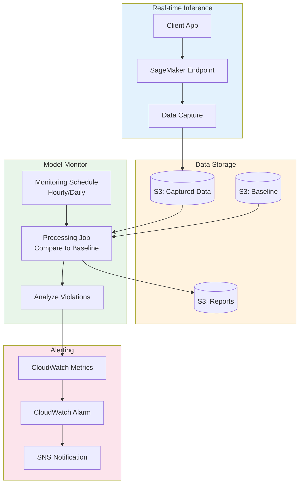
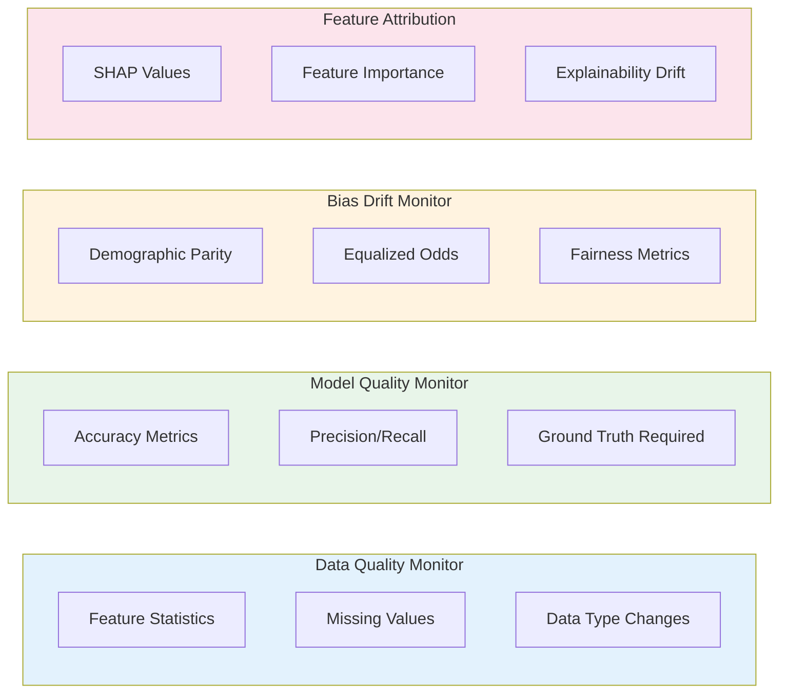
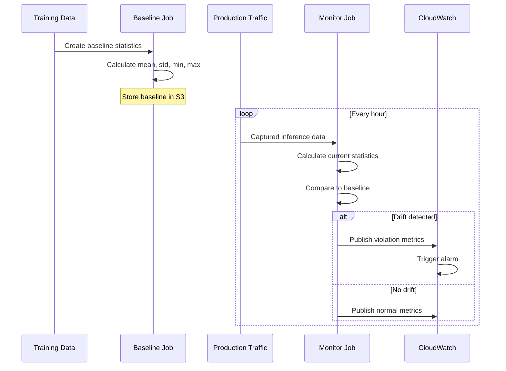

# Lab 07: SageMaker Model Monitor

## Overview
Set up Model Monitor to detect data drift in a deployed model endpoint.

**Duration**: 60-90 minutes
**Cost**: ~$5-10
**Prerequisites**: Deployed SageMaker endpoint

---

## Architecture Overview



### Monitor Types



### Drift Detection Flow



---

## Lab Objectives

- [ ] Enable data capture on an endpoint
- [ ] Create a baseline from training data
- [ ] Set up a monitoring schedule
- [ ] Analyze monitoring results

---

## Part 1: Deploy Model with Data Capture

```python
# Cell 1: Setup
import sagemaker
from sagemaker.model_monitor import DataCaptureConfig, DefaultModelMonitor
from sagemaker.model_monitor.dataset_format import DatasetFormat
import pandas as pd
import numpy as np

session = sagemaker.Session()
role = sagemaker.get_execution_role()
bucket = session.default_bucket()

# Assuming you have a trained model from Lab 01
# If not, train a quick XGBoost model first
```

```python
# Cell 2: Configure data capture
data_capture_config = DataCaptureConfig(
    enable_capture=True,
    sampling_percentage=100,  # Capture all requests
    destination_s3_uri=f"s3://{bucket}/model-monitor/data-capture",
    capture_options=["Input", "Output"],
    csv_content_types=["text/csv"],
    json_content_types=["application/json"]
)

# Deploy model with data capture
predictor = model.deploy(
    initial_instance_count=1,
    instance_type="ml.t2.medium",
    data_capture_config=data_capture_config,
    endpoint_name="monitor-lab-endpoint"
)

print(f"Endpoint deployed: {predictor.endpoint_name}")
```

---

## Part 2: Generate Baseline

```python
# Cell 3: Create baseline from training data
monitor = DefaultModelMonitor(
    role=role,
    instance_count=1,
    instance_type="ml.m5.xlarge",
    volume_size_in_gb=20,
    max_runtime_in_seconds=3600
)

# Suggest baseline from training data
monitor.suggest_baseline(
    baseline_dataset=f"s3://{bucket}/train/train.csv",
    dataset_format=DatasetFormat.csv(header=True),
    output_s3_uri=f"s3://{bucket}/model-monitor/baseline",
    wait=True
)

print("Baseline created!")

# View baseline statistics
!aws s3 cp s3://{bucket}/model-monitor/baseline/statistics.json ./
!cat statistics.json | python -m json.tool | head -50
```

---

## Part 3: Create Monitoring Schedule

```python
# Cell 4: Create monitoring schedule
from sagemaker.model_monitor import CronExpressionGenerator

monitor.create_monitoring_schedule(
    monitor_schedule_name="monitor-lab-schedule",
    endpoint_input=predictor.endpoint_name,
    output_s3_uri=f"s3://{bucket}/model-monitor/reports",
    statistics=f"s3://{bucket}/model-monitor/baseline/statistics.json",
    constraints=f"s3://{bucket}/model-monitor/baseline/constraints.json",
    schedule_cron_expression=CronExpressionGenerator.hourly(),
    enable_cloudwatch_metrics=True
)

print("Monitoring schedule created!")
```

---

## Part 4: Generate Traffic and Observe

```python
# Cell 5: Generate predictions to create captured data
import time

# Normal predictions
for i in range(50):
    sample = np.random.randn(1, 20)
    predictor.predict(sample)

print("Normal predictions sent")

# Drifted predictions (different distribution)
for i in range(50):
    sample = np.random.randn(1, 20) * 5 + 10  # Shifted distribution
    predictor.predict(sample)

print("Drifted predictions sent")
print("Wait for monitoring job to run (hourly schedule)")
```

---

## Part 5: Check Monitoring Results

```python
# Cell 6: List monitoring executions
executions = monitor.list_executions()

if executions:
    latest = executions[-1]
    print(f"Latest execution: {latest}")

    # Check for violations
    if latest.exit_message:
        print(f"Exit message: {latest.exit_message}")

    # Download violation report
    !aws s3 ls s3://{bucket}/model-monitor/reports/ --recursive
```

---

## Part 6: Clean Up

```python
# Delete monitoring schedule
monitor.delete_monitoring_schedule()

# Delete endpoint
predictor.delete_endpoint()

# Clean up S3
!aws s3 rm s3://{bucket}/model-monitor/ --recursive

print("Cleanup complete!")
```

---

## Lab Summary

| Concept | What You Did |
|---------|--------------|
| **Data Capture** | Enabled capture on endpoint |
| **Baseline** | Created from training data |
| **Schedule** | Set up hourly monitoring |
| **Drift Detection** | Generated drifted data |

---

## Exam Relevance

- ✅ Four types of monitoring (Data Quality, Model Quality, Bias, Feature Attribution)
- ✅ Data capture configuration
- ✅ Baseline creation
- ✅ CloudWatch integration

---

## Next Lab

Continue to [Lab 08: Custom Container ECR](../08-custom-container-ecr/LAB.md) →
