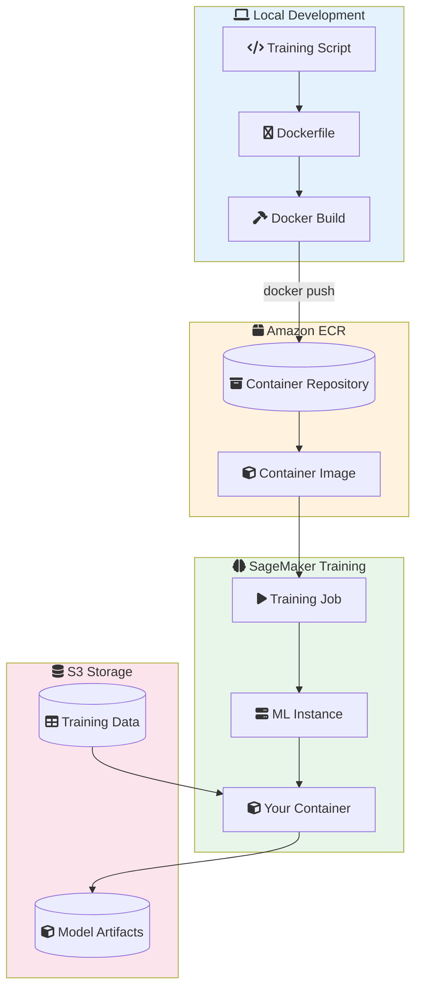
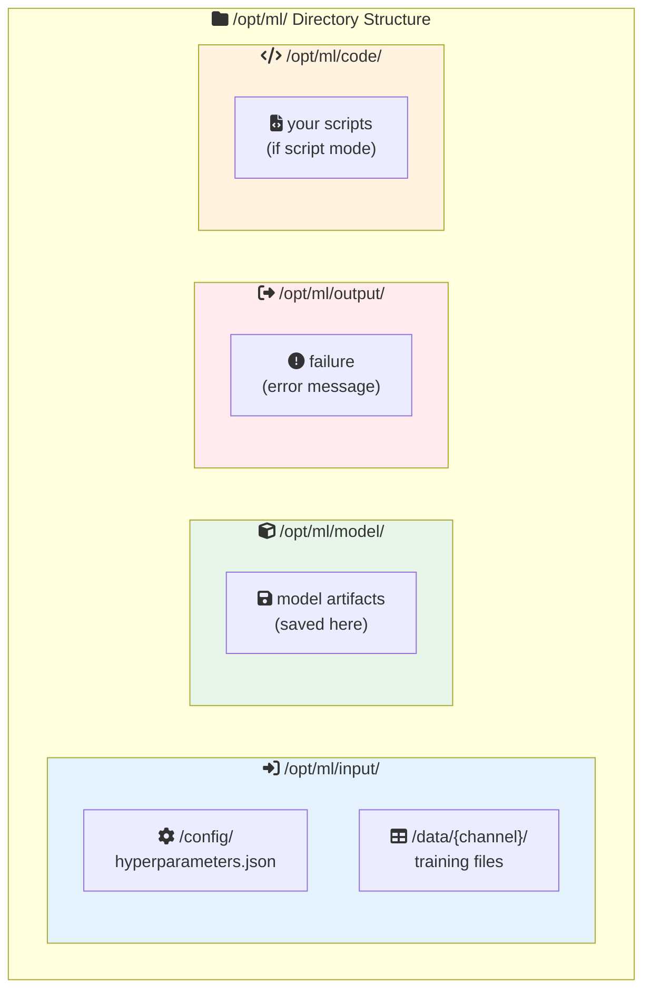
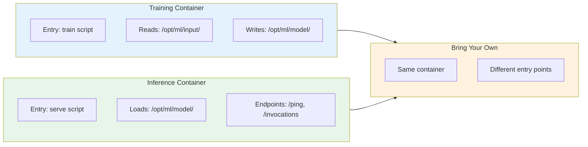

# Lab 08: Custom Containers with Amazon ECR

## Overview
Build and deploy a custom training container for SageMaker using Amazon ECR.

**Duration**: 45-60 minutes
**Cost**: ~$2-3
**Prerequisites**: Docker installed locally

---

## Architecture Overview



### SageMaker Container Contract



### Training vs Inference Container



---

## Lab Objectives

- [ ] Create a custom training container
- [ ] Push container to Amazon ECR
- [ ] Train a model using the custom container
- [ ] Understand the SageMaker container contract

---

## Part 1: Create Custom Training Container

### Step 1.1: Create Training Script

```bash
mkdir custom-container && cd custom-container

cat > train.py << 'EOF'
#!/usr/bin/env python
"""
Custom training script following SageMaker contract.
Model artifacts must be saved to /opt/ml/model/
"""

import os
import json
import pickle
import pandas as pd
from sklearn.ensemble import RandomForestClassifier
from sklearn.metrics import accuracy_score

# SageMaker paths
MODEL_DIR = os.environ.get('SM_MODEL_DIR', '/opt/ml/model')
TRAIN_DIR = os.environ.get('SM_CHANNEL_TRAIN', '/opt/ml/input/data/train')
HYPERPARAMS_PATH = '/opt/ml/input/config/hyperparameters.json'

def load_hyperparameters():
    if os.path.exists(HYPERPARAMS_PATH):
        with open(HYPERPARAMS_PATH, 'r') as f:
            return json.load(f)
    return {}

def train():
    params = load_hyperparameters()
    n_estimators = int(params.get('n_estimators', '100'))
    max_depth = int(params.get('max_depth', '10'))

    # Load training data
    train_files = [f for f in os.listdir(TRAIN_DIR) if f.endswith('.csv')]
    df = pd.read_csv(os.path.join(TRAIN_DIR, train_files[0]), header=None)

    X = df.iloc[:, 1:].values
    y = df.iloc[:, 0].values

    print(f"Training with n_estimators={n_estimators}, max_depth={max_depth}")
    print(f"Training samples: {len(X)}")

    # Train model
    model = RandomForestClassifier(n_estimators=n_estimators, max_depth=max_depth)
    model.fit(X, y)

    # Evaluate
    accuracy = accuracy_score(y, model.predict(X))
    print(f"Training accuracy: {accuracy:.4f}")

    # Save model to /opt/ml/model/
    os.makedirs(MODEL_DIR, exist_ok=True)
    with open(os.path.join(MODEL_DIR, 'model.pkl'), 'wb') as f:
        pickle.dump(model, f)

    print(f"Model saved to {MODEL_DIR}")

if __name__ == '__main__':
    train()
EOF
```

### Step 1.2: Create Dockerfile

```bash
cat > Dockerfile << 'EOF'
FROM python:3.9-slim

# Install dependencies
RUN pip install pandas scikit-learn numpy

# Copy training script
COPY train.py /opt/ml/code/train.py

# Set working directory
WORKDIR /opt/ml/code

# Set entrypoint
ENTRYPOINT ["python", "train.py"]
EOF
```

---

## Part 2: Build and Push to ECR

```bash
# Set variables
ACCOUNT_ID=$(aws sts get-caller-identity --query Account --output text)
REGION=$(aws configure get region)
REPO_NAME="custom-ml-container"
TAG="latest"

# Create ECR repository
aws ecr create-repository --repository-name $REPO_NAME 2>/dev/null || true

# Login to ECR
aws ecr get-login-password --region $REGION | \
    docker login --username AWS --password-stdin $ACCOUNT_ID.dkr.ecr.$REGION.amazonaws.com

# Build container
docker build -t $REPO_NAME:$TAG .

# Tag for ECR
docker tag $REPO_NAME:$TAG $ACCOUNT_ID.dkr.ecr.$REGION.amazonaws.com/$REPO_NAME:$TAG

# Push to ECR
docker push $ACCOUNT_ID.dkr.ecr.$REGION.amazonaws.com/$REPO_NAME:$TAG

echo "Container pushed to ECR"
IMAGE_URI="$ACCOUNT_ID.dkr.ecr.$REGION.amazonaws.com/$REPO_NAME:$TAG"
echo "Image URI: $IMAGE_URI"
```

---

## Part 3: Use Custom Container in SageMaker

```python
# In a SageMaker notebook
import sagemaker
from sagemaker.estimator import Estimator

session = sagemaker.Session()
role = sagemaker.get_execution_role()
bucket = session.default_bucket()

# Your custom container image URI
image_uri = "YOUR_ACCOUNT_ID.dkr.ecr.YOUR_REGION.amazonaws.com/custom-ml-container:latest"

# Create estimator with custom container
estimator = Estimator(
    image_uri=image_uri,
    role=role,
    instance_count=1,
    instance_type='ml.m5.large',
    output_path=f's3://{bucket}/custom-container-output/',
    hyperparameters={
        'n_estimators': '100',
        'max_depth': '5'
    }
)

# Train
estimator.fit({
    'train': f's3://{bucket}/train/'
})

print("Training complete!")
print(f"Model artifacts: {estimator.model_data}")
```

---

## Part 4: Clean Up

```bash
# Delete ECR repository
aws ecr delete-repository --repository-name $REPO_NAME --force

# Clean up local files
cd ..
rm -rf custom-container

# Clean up S3
aws s3 rm s3://$BUCKET_NAME/custom-container-output/ --recursive
```

---

## Lab Summary

| Concept | What You Did |
|---------|--------------|
| **Dockerfile** | Created container for training |
| **SageMaker Contract** | Used /opt/ml paths |
| **ECR** | Pushed container to registry |
| **Training** | Ran training with custom container |

---

## Exam Relevance

- ✅ /opt/ml directory structure
- ✅ When to use custom containers vs Script Mode
- ✅ ECR integration with SageMaker

---

## Next Lab

Continue to [Lab 09: Bedrock RAG](../09-bedrock-rag/LAB.md) →
