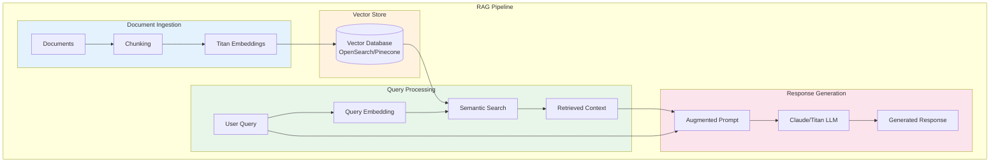
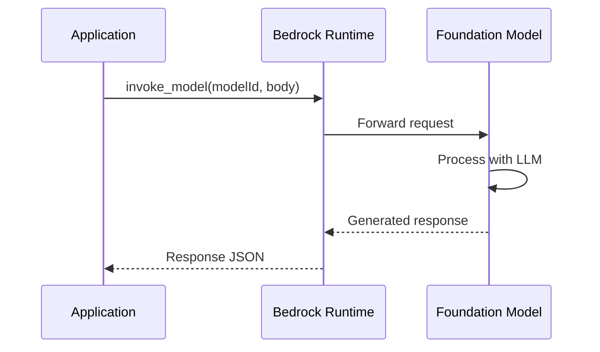
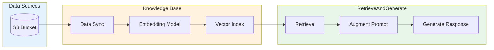

# Lab 09: Amazon Bedrock RAG Application

## Overview
Build a Retrieval Augmented Generation (RAG) application using Amazon Bedrock.

**Duration**: 45-60 minutes
**Cost**: ~$1-2 (pay per token)
**Prerequisites**: Bedrock model access enabled

---

## Architecture Overview



### Bedrock Model Invocation



### Knowledge Bases Architecture



---

## Lab Objectives

- [ ] Invoke foundation models via Bedrock
- [ ] Generate embeddings with Titan
- [ ] Build a simple RAG pipeline
- [ ] Understand Knowledge Bases concepts

---

## Part 1: Basic Model Invocation

### Step 1.1: Enable Model Access

1. Go to **Amazon Bedrock Console**
2. Click **Model access** in the left menu
3. Enable access to:
   - Amazon Titan Text Express
   - Amazon Titan Embeddings
   - Anthropic Claude (optional)

### Step 1.2: Invoke Text Model

```python
import boto3
import json

bedrock = boto3.client('bedrock-runtime')

# Invoke Titan Text
def invoke_titan(prompt, max_tokens=512):
    response = bedrock.invoke_model(
        modelId='amazon.titan-text-express-v1',
        contentType='application/json',
        accept='application/json',
        body=json.dumps({
            "inputText": prompt,
            "textGenerationConfig": {
                "maxTokenCount": max_tokens,
                "temperature": 0.7,
                "topP": 0.9
            }
        })
    )

    result = json.loads(response['body'].read())
    return result['results'][0]['outputText']

# Test
response = invoke_titan("Explain machine learning in 2 sentences.")
print(response)
```

---

## Part 2: Generate Embeddings

```python
# Generate embeddings with Titan Embeddings
def get_embedding(text):
    response = bedrock.invoke_model(
        modelId='amazon.titan-embed-text-v1',
        contentType='application/json',
        accept='application/json',
        body=json.dumps({
            "inputText": text
        })
    )

    result = json.loads(response['body'].read())
    return result['embedding']

# Test
embedding = get_embedding("Machine learning is a subset of AI")
print(f"Embedding dimension: {len(embedding)}")
print(f"First 5 values: {embedding[:5]}")
```

---

## Part 3: Build Simple RAG Pipeline

```python
import numpy as np
from typing import List

# Sample knowledge base (documents)
documents = [
    "Amazon SageMaker is a fully managed machine learning service.",
    "SageMaker provides built-in algorithms like XGBoost and Linear Learner.",
    "Model training in SageMaker uses training jobs that run on EC2 instances.",
    "SageMaker endpoints provide real-time inference for deployed models.",
    "Feature Store is used to store and manage ML features.",
    "SageMaker Pipelines enables ML CI/CD automation."
]

# Generate embeddings for all documents
doc_embeddings = [get_embedding(doc) for doc in documents]

def cosine_similarity(a, b):
    return np.dot(a, b) / (np.linalg.norm(a) * np.linalg.norm(b))

def retrieve_relevant_docs(query: str, top_k: int = 3) -> List[str]:
    """Retrieve most relevant documents for the query."""
    query_embedding = get_embedding(query)

    # Calculate similarities
    similarities = [
        cosine_similarity(query_embedding, doc_emb)
        for doc_emb in doc_embeddings
    ]

    # Get top-k indices
    top_indices = np.argsort(similarities)[-top_k:][::-1]

    return [documents[i] for i in top_indices]

def rag_query(question: str) -> str:
    """Answer question using RAG."""
    # Retrieve relevant context
    relevant_docs = retrieve_relevant_docs(question, top_k=3)
    context = "\n".join(relevant_docs)

    # Create augmented prompt
    prompt = f"""Use the following context to answer the question.
If the answer is not in the context, say "I don't know."

Context:
{context}

Question: {question}

Answer:"""

    # Generate response
    response = invoke_titan(prompt)
    return response

# Test RAG
question = "What is SageMaker Feature Store used for?"
answer = rag_query(question)
print(f"Question: {question}")
print(f"Answer: {answer}")
```

---

## Part 4: Using Claude Model (Optional)

```python
# Invoke Claude model
def invoke_claude(prompt, max_tokens=512):
    response = bedrock.invoke_model(
        modelId='anthropic.claude-3-sonnet-20240229-v1:0',
        contentType='application/json',
        accept='application/json',
        body=json.dumps({
            "anthropic_version": "bedrock-2023-05-31",
            "max_tokens": max_tokens,
            "messages": [
                {"role": "user", "content": prompt}
            ]
        })
    )

    result = json.loads(response['body'].read())
    return result['content'][0]['text']

# Test
response = invoke_claude("What are the key components of MLOps?")
print(response)
```

---

## Part 5: Clean Up

```python
# No resources to clean up - Bedrock is pay-per-use
print("No cleanup needed - Bedrock charges per API call only")
```

---

## Lab Challenges

### Challenge 1: Add Conversation History
Modify the Claude invocation to maintain conversation context.

### Challenge 2: Use Knowledge Bases
Create a Bedrock Knowledge Base with S3 documents.

---

## Lab Summary

| Concept | What You Did |
|---------|--------------|
| **Text Generation** | Invoked Titan Text model |
| **Embeddings** | Generated vectors with Titan Embeddings |
| **RAG** | Built retrieval + generation pipeline |
| **Claude** | Invoked Claude model (optional) |

---

## Exam Relevance

- ✅ Foundation models in Bedrock
- ✅ RAG architecture and use cases
- ✅ Embeddings for semantic search
- ✅ Knowledge Bases concept

---

## Next Lab

Continue to [Lab 10: Rekognition App](../10-rekognition-app/LAB.md) →
