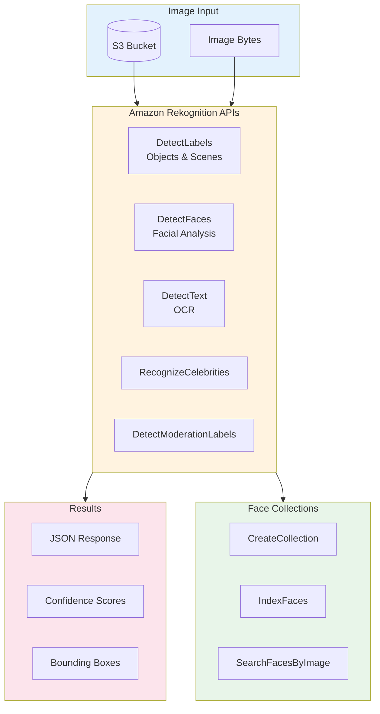
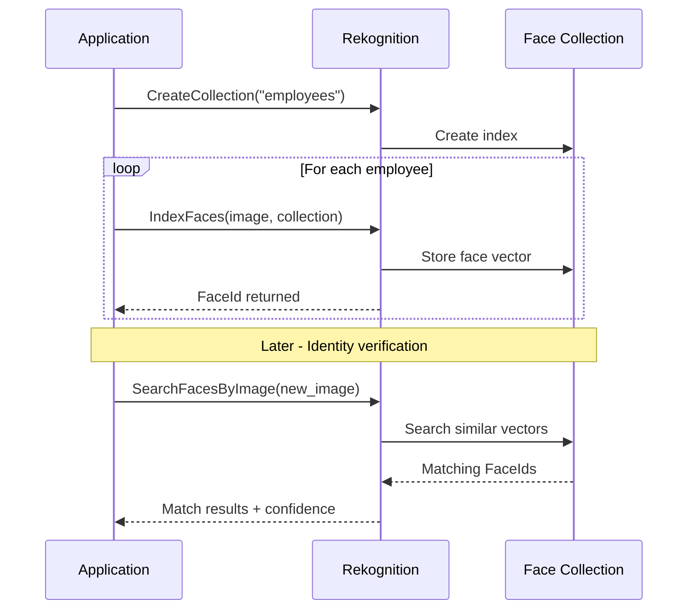
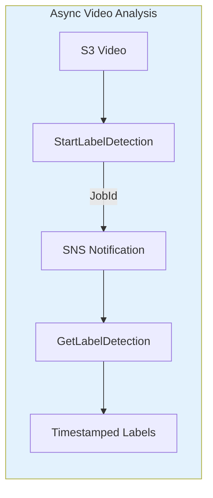

# Lab 10: Amazon Rekognition

## Overview
Use Amazon Rekognition for image analysis including object detection, face analysis, and text detection.

**Duration**: 30-45 minutes
**Cost**: ~$1 (free tier available)
**Prerequisites**: AWS Account

---

## Architecture Overview



### Face Collection Workflow



### Video Analysis Pipeline



---

## Lab Objectives

- [ ] Detect labels (objects) in images
- [ ] Analyze faces in photos
- [ ] Detect text in images
- [ ] Create a face collection

---

## Part 1: Setup and Detect Labels

### Step 1.1: Upload Sample Image

```bash
# Download sample image
curl -o sample-image.jpg "https://images.unsplash.com/photo-1517849845537-4d257902454a?w=640"

# Upload to S3
aws s3 cp sample-image.jpg s3://YOUR_BUCKET/rekognition-lab/
```

### Step 1.2: Detect Labels

```python
import boto3

rekognition = boto3.client('rekognition')

# Detect labels (objects, scenes)
response = rekognition.detect_labels(
    Image={
        'S3Object': {
            'Bucket': 'YOUR_BUCKET',
            'Name': 'rekognition-lab/sample-image.jpg'
        }
    },
    MaxLabels=10,
    MinConfidence=80
)

print("Detected Labels:")
for label in response['Labels']:
    print(f"  {label['Name']}: {label['Confidence']:.2f}%")
    for instance in label.get('Instances', []):
        box = instance['BoundingBox']
        print(f"    Bounding Box: {box}")
```

---

## Part 2: Face Detection

```python
# Download face image
# Use any image with a face

# Detect faces
response = rekognition.detect_faces(
    Image={
        'S3Object': {
            'Bucket': 'YOUR_BUCKET',
            'Name': 'rekognition-lab/face-image.jpg'
        }
    },
    Attributes=['ALL']
)

print("Face Analysis:")
for face in response['FaceDetails']:
    print(f"  Age Range: {face['AgeRange']['Low']}-{face['AgeRange']['High']}")
    print(f"  Gender: {face['Gender']['Value']} ({face['Gender']['Confidence']:.1f}%)")
    print(f"  Emotions:")
    for emotion in face['Emotions'][:3]:
        print(f"    - {emotion['Type']}: {emotion['Confidence']:.1f}%")
    print(f"  Smile: {face['Smile']['Value']}")
    print(f"  Eyeglasses: {face['Eyeglasses']['Value']}")
```

---

## Part 3: Text Detection (OCR)

```python
# Detect text in image
response = rekognition.detect_text(
    Image={
        'S3Object': {
            'Bucket': 'YOUR_BUCKET',
            'Name': 'rekognition-lab/text-image.jpg'
        }
    }
)

print("Detected Text:")
for text in response['TextDetections']:
    if text['Type'] == 'LINE':
        print(f"  {text['DetectedText']} (Confidence: {text['Confidence']:.1f}%)")
```

---

## Part 4: Face Collection

```python
# Create face collection
collection_id = 'lab-faces'

rekognition.create_collection(CollectionId=collection_id)
print(f"Collection '{collection_id}' created")

# Index a face
response = rekognition.index_faces(
    CollectionId=collection_id,
    Image={
        'S3Object': {
            'Bucket': 'YOUR_BUCKET',
            'Name': 'rekognition-lab/person1.jpg'
        }
    },
    ExternalImageId='person-001',
    MaxFaces=1,
    DetectionAttributes=['ALL']
)

face_id = response['FaceRecords'][0]['Face']['FaceId']
print(f"Indexed face: {face_id}")

# Search for face
response = rekognition.search_faces_by_image(
    CollectionId=collection_id,
    Image={
        'S3Object': {
            'Bucket': 'YOUR_BUCKET',
            'Name': 'rekognition-lab/search-image.jpg'
        }
    },
    FaceMatchThreshold=80,
    MaxFaces=5
)

for match in response['FaceMatches']:
    print(f"Match: {match['Face']['ExternalImageId']} ({match['Similarity']:.1f}%)")
```

---

## Part 5: Clean Up

```python
# Delete collection
rekognition.delete_collection(CollectionId=collection_id)

# Delete S3 objects
!aws s3 rm s3://YOUR_BUCKET/rekognition-lab/ --recursive
```

---

## Lab Summary

| Concept | What You Did |
|---------|--------------|
| **Label Detection** | Identified objects in images |
| **Face Analysis** | Detected age, emotion, attributes |
| **Text Detection** | Extracted text (OCR) |
| **Face Collection** | Built searchable face database |

---

## Exam Relevance

- ✅ Rekognition API capabilities
- ✅ Face collections for search
- ✅ When to use Rekognition vs Textract

---

## Next Lab

Continue to [Lab 11: Comprehend NLP](../11-comprehend-nlp/LAB.md) →
