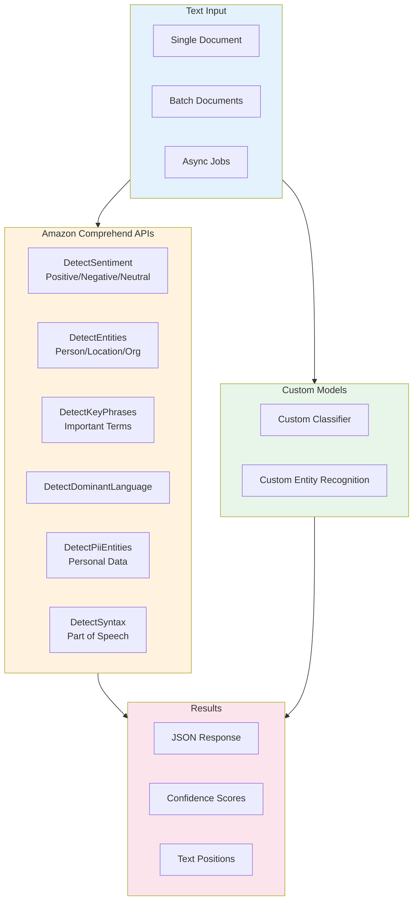
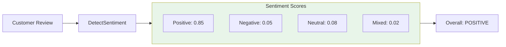
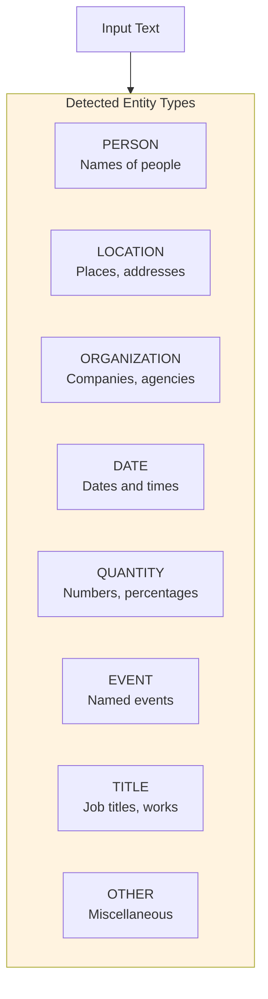
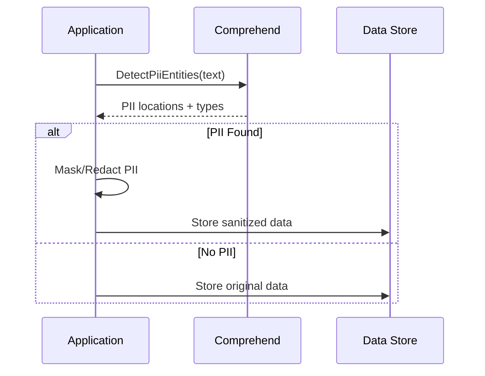

# Lab 11: Amazon Comprehend NLP

## Overview
Use Amazon Comprehend for natural language processing tasks.

**Duration**: 30-45 minutes
**Cost**: ~$1
**Prerequisites**: AWS Account

---

## Architecture Overview



### Sentiment Analysis Flow



### Entity Types



### PII Detection for Compliance



---

## Lab Objectives

- [ ] Perform sentiment analysis
- [ ] Extract entities from text
- [ ] Detect key phrases
- [ ] Identify PII data

---

## Part 1: Sentiment Analysis

```python
import boto3

comprehend = boto3.client('comprehend')

# Sample texts
texts = [
    "I love this product! It's absolutely amazing and exceeded my expectations.",
    "The service was terrible. I'm very disappointed with my purchase.",
    "The product arrived on time. It works as described.",
    "Great quality but shipping was slow. Mixed feelings overall."
]

print("Sentiment Analysis:")
print("-" * 50)

for text in texts:
    response = comprehend.detect_sentiment(
        Text=text,
        LanguageCode='en'
    )

    print(f"Text: {text[:50]}...")
    print(f"Sentiment: {response['Sentiment']}")
    print(f"Scores: Pos={response['SentimentScore']['Positive']:.2f}, "
          f"Neg={response['SentimentScore']['Negative']:.2f}")
    print()
```

---

## Part 2: Entity Recognition

```python
# Sample text with entities
text = """
Amazon Web Services was founded in 2006 and is headquartered in Seattle.
The CEO Andy Jassy announced new AI services at re:Invent 2024.
AWS has data centers across 99 availability zones worldwide.
"""

response = comprehend.detect_entities(
    Text=text,
    LanguageCode='en'
)

print("Named Entities:")
print("-" * 50)
for entity in response['Entities']:
    print(f"  {entity['Text']}")
    print(f"    Type: {entity['Type']}")
    print(f"    Confidence: {entity['Score']:.2f}")
    print()
```

---

## Part 3: Key Phrase Extraction

```python
text = """
Machine learning models require large amounts of training data
to achieve high accuracy. Feature engineering is a critical step
in the model development process. Deep learning has revolutionized
computer vision and natural language processing applications.
"""

response = comprehend.detect_key_phrases(
    Text=text,
    LanguageCode='en'
)

print("Key Phrases:")
print("-" * 50)
for phrase in response['KeyPhrases']:
    print(f"  {phrase['Text']} (Confidence: {phrase['Score']:.2f})")
```

---

## Part 4: PII Detection

```python
text = """
Customer John Smith placed an order today.
Contact email: john.smith@example.com
Phone: 555-123-4567
Credit card ending in 4242
SSN: 123-45-6789
"""

response = comprehend.detect_pii_entities(
    Text=text,
    LanguageCode='en'
)

print("PII Detected:")
print("-" * 50)
for entity in response['Entities']:
    # Get the actual text using offsets
    pii_text = text[entity['BeginOffset']:entity['EndOffset']]
    print(f"  Type: {entity['Type']}")
    print(f"  Text: {pii_text}")
    print(f"  Confidence: {entity['Score']:.2f}")
    print()
```

---

## Part 5: Language Detection

```python
texts = [
    "Hello, how are you today?",
    "Bonjour, comment allez-vous?",
    "Hola, cómo estás?",
    "こんにちは、お元気ですか？"
]

print("Language Detection:")
print("-" * 50)
for text in texts:
    response = comprehend.detect_dominant_language(Text=text)
    lang = response['Languages'][0]
    print(f"  '{text[:30]}...'")
    print(f"    Language: {lang['LanguageCode']} ({lang['Score']:.2f})")
    print()
```

---

## Part 6: Batch Processing (Optional)

```python
# For large-scale processing, use async batch jobs
# This is more cost-effective for >25,000 characters

# Example: Start batch job
# response = comprehend.start_entities_detection_job(
#     InputDataConfig={
#         'S3Uri': 's3://bucket/input/',
#         'InputFormat': 'ONE_DOC_PER_LINE'
#     },
#     OutputDataConfig={
#         'S3Uri': 's3://bucket/output/'
#     },
#     DataAccessRoleArn=role_arn,
#     LanguageCode='en'
# )
```

---

## Lab Summary

| Concept | What You Did |
|---------|--------------|
| **Sentiment** | Analyzed positive/negative/neutral |
| **Entities** | Extracted names, places, dates |
| **Key Phrases** | Identified important phrases |
| **PII** | Detected personal information |

---

## Exam Relevance

- ✅ Comprehend API capabilities
- ✅ Entity types (PERSON, ORGANIZATION, etc.)
- ✅ PII detection for compliance
- ✅ Batch processing for scale

---

## Next Lab

Continue to [Lab 12: Textract Docs](../12-textract-docs/LAB.md) →
