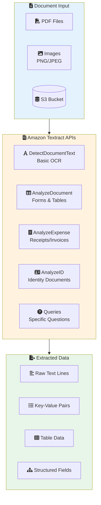
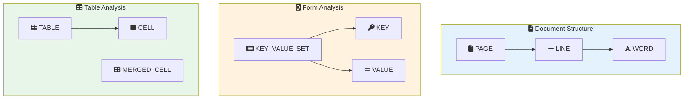
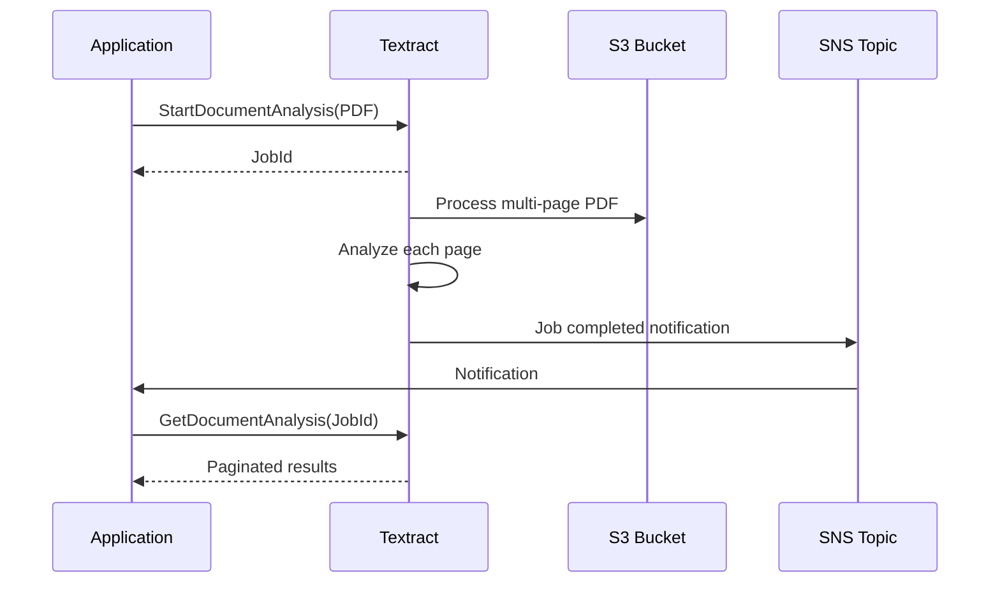

# Lab 12: Amazon Textract

## Overview
Extract text, forms, and tables from documents using Amazon Textract[^textract].

**Duration**: 30-45 minutes
**Cost**: ~$1
**Prerequisites**: AWS Account, sample document images

---

## Architecture Overview



### Block Hierarchy



### Async Processing for Large Documents



---

## Lab Objectives

- [ ] Extract text from documents using OCR[^ocr]
- [ ] Parse form key-value pairs[^key-value-pairs]
- [ ] Extract table[^tables] data
- [ ] Use Queries[^queries] for specific information

---

## Part 1: Basic Text Detection

```python
import boto3

textract = boto3.client('textract')

# Detect text (for single-page documents)
response = textract.detect_document_text(
    Document={
        'S3Object': {
            'Bucket': 'YOUR_BUCKET',
            'Name': 'textract-lab/document.png'
        }
    }
)

print("Extracted Text:")
print("-" * 50)
for block in response['Blocks']:
    if block['BlockType'] == 'LINE':
        print(block['Text'])
```

The DetectDocumentText[^detect-document-text] API performs basic OCR to extract raw text from documents.

---

## Part 2: Form Extraction (Key-Value Pairs)

```python
# Analyze document for forms
response = textract.analyze_document(
    Document={
        'S3Object': {
            'Bucket': 'YOUR_BUCKET',
            'Name': 'textract-lab/form.png'
        }
    },
    FeatureTypes=['FORMS']
)

# Helper function to extract key-value pairs
def get_kv_pairs(response):
    key_map = {}
    value_map = {}
    block_map = {}

    for block in response['Blocks']:
        block_id = block['Id']
        block_map[block_id] = block

        if block['BlockType'] == 'KEY_VALUE_SET':
            if 'KEY' in block.get('EntityTypes', []):
                key_map[block_id] = block
            else:
                value_map[block_id] = block

    # Extract pairs
    kvs = {}
    for key_id, key_block in key_map.items():
        key_text = get_text(key_block, block_map)

        value_block = None
        for rel in key_block.get('Relationships', []):
            if rel['Type'] == 'VALUE':
                for val_id in rel['Ids']:
                    value_block = block_map[val_id]

        value_text = get_text(value_block, block_map) if value_block else ""
        kvs[key_text] = value_text

    return kvs

def get_text(block, block_map):
    text = ""
    if block and 'Relationships' in block:
        for rel in block['Relationships']:
            if rel['Type'] == 'CHILD':
                for child_id in rel['Ids']:
                    child = block_map[child_id]
                    if child['BlockType'] == 'WORD':
                        text += child['Text'] + " "
    return text.strip()

kv_pairs = get_kv_pairs(response)
print("\nForm Fields:")
print("-" * 50)
for key, value in kv_pairs.items():
    print(f"  {key}: {value}")
```

The AnalyzeDocument[^analyze-document] API with FORMS[^forms] feature extracts structured key-value pairs from forms.

---

## Part 3: Table Extraction

```python
# Analyze document for tables
response = textract.analyze_document(
    Document={
        'S3Object': {
            'Bucket': 'YOUR_BUCKET',
            'Name': 'textract-lab/table.png'
        }
    },
    FeatureTypes=['TABLES']
)

# Extract table data
def get_table_data(response):
    blocks = response['Blocks']
    block_map = {b['Id']: b for b in blocks}

    tables = []
    for block in blocks:
        if block['BlockType'] == 'TABLE':
            table = {}
            for rel in block.get('Relationships', []):
                if rel['Type'] == 'CHILD':
                    for cell_id in rel['Ids']:
                        cell = block_map[cell_id]
                        if cell['BlockType'] == 'CELL':
                            row = cell['RowIndex']
                            col = cell['ColumnIndex']
                            text = get_text(cell, block_map)
                            table[(row, col)] = text
            tables.append(table)

    return tables

tables = get_table_data(response)
print("\nTable Data:")
print("-" * 50)
for i, table in enumerate(tables):
    print(f"Table {i+1}:")
    max_row = max(k[0] for k in table.keys())
    max_col = max(k[1] for k in table.keys())
    for row in range(1, max_row + 1):
        row_data = [table.get((row, col), "") for col in range(1, max_col + 1)]
        print(f"  {row_data}")
```

---

## Part 4: Using Queries

```python
# Use queries to extract specific information
response = textract.analyze_document(
    Document={
        'S3Object': {
            'Bucket': 'YOUR_BUCKET',
            'Name': 'textract-lab/invoice.png'
        }
    },
    FeatureTypes=['QUERIES'],
    QueriesConfig={
        'Queries': [
            {'Text': 'What is the invoice number?'},
            {'Text': 'What is the total amount?'},
            {'Text': 'What is the invoice date?'},
            {'Text': 'Who is the vendor?'}
        ]
    }
)

print("\nQuery Results:")
print("-" * 50)
for block in response['Blocks']:
    if block['BlockType'] == 'QUERY':
        query = block['Query']['Text']
        print(f"Q: {query}")

    if block['BlockType'] == 'QUERY_RESULT':
        print(f"A: {block['Text']} (Confidence: {block['Confidence']:.1f}%)")
        print()
```

---

## Part 5: Expense Analysis

```python
# Analyze invoice/receipt
response = textract.analyze_expense(
    Document={
        'S3Object': {
            'Bucket': 'YOUR_BUCKET',
            'Name': 'textract-lab/receipt.png'
        }
    }
)

print("\nExpense Analysis:")
print("-" * 50)
for doc in response['ExpenseDocuments']:
    print("Summary Fields:")
    for field in doc['SummaryFields']:
        field_type = field['Type']['Text']
        value = field['ValueDetection']['Text']
        print(f"  {field_type}: {value}")
```

---

## Lab Summary

| Concept | What You Did |
|---------|--------------|
| **Text Detection** | Basic OCR extraction |
| **Forms** | Key-value pair extraction |
| **Tables** | Structured table data |
| **Queries** | Specific information extraction |

---

## Exam Relevance

- ✅ Textract API features (Forms, Tables, Queries)
- ✅ When to use Textract vs Rekognition
- ✅ Async processing for multi-page PDFs
- ✅ Block[^block] structure and relationships

---

## Glossary

[^textract]: **Amazon Textract** - A fully managed ML service that automatically extracts text, handwriting, and structured data from scanned documents.

[^ocr]: **OCR (Optical Character Recognition)** - The technology that converts images of text into machine-readable text data.

[^detect-document-text]: **DetectDocumentText** - A Textract API that performs basic OCR to extract raw text lines and words from single-page documents.

[^analyze-document]: **AnalyzeDocument** - A Textract API that extracts structured data including forms, tables, and query responses from documents.

[^forms]: **Forms** - A Textract feature type that identifies and extracts key-value pairs from form fields in documents.

[^tables]: **Tables** - A Textract feature type that detects and extracts tabular data with row and column structure from documents.

[^queries]: **Queries** - A Textract feature that allows asking natural language questions about document content to extract specific information.

[^block]: **Block** - The fundamental unit of data in Textract responses, representing detected elements like pages, lines, words, tables, cells, and key-value pairs.

[^key-value-pairs]: **Key-Value Pairs** - Structured data extracted from forms where a label (key) is associated with its corresponding value, such as "Name: John Smith".

---

## Next Lab

Continue to [Lab 13: Lambda Inference](../13-lambda-inference/LAB.md) →
