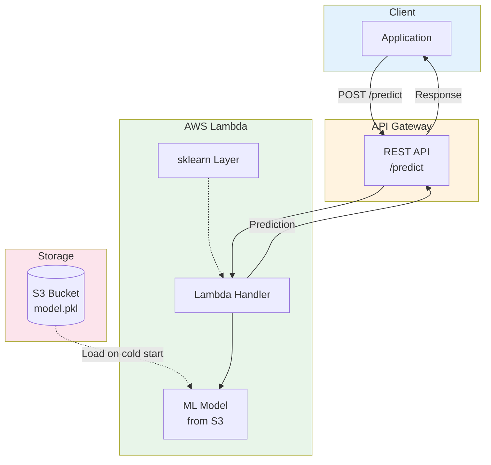
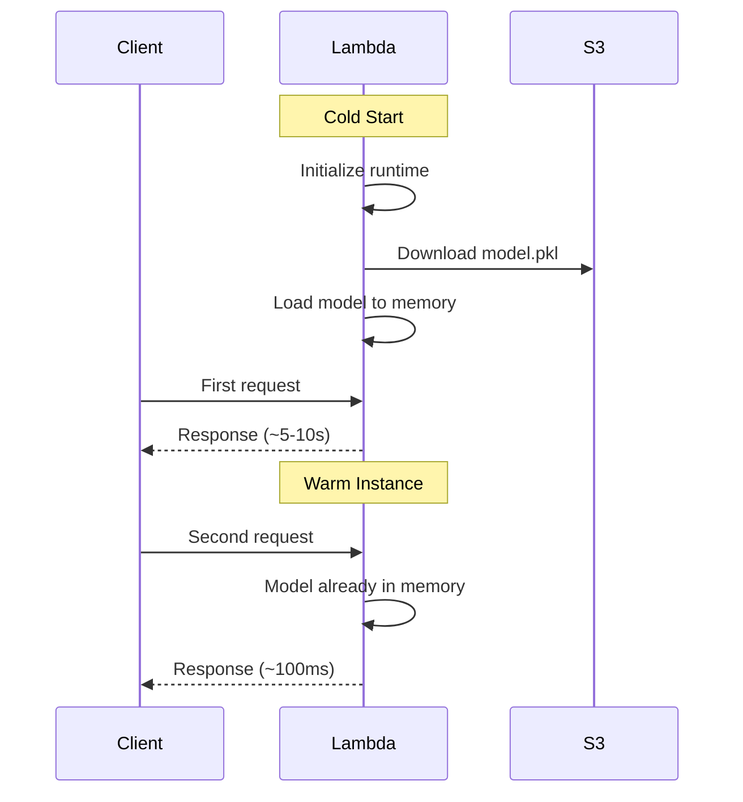
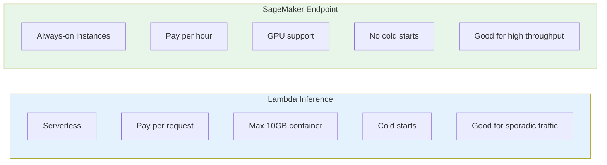

# Lab 13: AWS Lambda for ML Inference

## Overview
Deploy a lightweight ML model in AWS Lambda for serverless inference.

**Duration**: 45-60 minutes
**Cost**: ~$1 (free tier)
**Prerequisites**: Trained model, Docker for container deployment

---

## Architecture Overview



### Cold Start Optimization



### Lambda vs SageMaker Endpoints



---

## Lab Objectives

- [ ] Create a Lambda function for ML inference
- [ ] Deploy a scikit-learn model
- [ ] Configure API Gateway trigger
- [ ] Understand Lambda limits for ML

---

## Part 1: Prepare the Model

```python
# Train and save a simple model
import pickle
from sklearn.ensemble import RandomForestClassifier
from sklearn.datasets import make_classification
import numpy as np

# Train model
X, y = make_classification(n_samples=1000, n_features=10, random_state=42)
model = RandomForestClassifier(n_estimators=50, max_depth=5)
model.fit(X, y)

# Save model
with open('model.pkl', 'wb') as f:
    pickle.dump(model, f)

print(f"Model saved. Size: {os.path.getsize('model.pkl') / 1024:.1f} KB")
```

---

## Part 2: Create Lambda Function

### Step 2.1: Create Lambda Package

```bash
mkdir lambda-inference && cd lambda-inference

# Create handler
cat > lambda_function.py << 'EOF'
import json
import pickle
import boto3
import os

# Global variable for model (persists across invocations)
model = None
s3 = boto3.client('s3')

def load_model():
    global model
    if model is None:
        # Download model from S3
        bucket = os.environ['MODEL_BUCKET']
        key = os.environ['MODEL_KEY']
        s3.download_file(bucket, key, '/tmp/model.pkl')

        with open('/tmp/model.pkl', 'rb') as f:
            model = pickle.load(f)
        print("Model loaded successfully")
    return model

def lambda_handler(event, context):
    try:
        # Load model
        model = load_model()

        # Parse input
        body = json.loads(event.get('body', '{}'))
        features = body.get('features', [])

        if not features:
            return {
                'statusCode': 400,
                'body': json.dumps({'error': 'No features provided'})
            }

        # Make prediction
        import numpy as np
        X = np.array(features).reshape(1, -1)
        prediction = model.predict(X)
        probability = model.predict_proba(X)

        return {
            'statusCode': 200,
            'headers': {'Content-Type': 'application/json'},
            'body': json.dumps({
                'prediction': int(prediction[0]),
                'probability': probability[0].tolist()
            })
        }

    except Exception as e:
        return {
            'statusCode': 500,
            'body': json.dumps({'error': str(e)})
        }
EOF
```

### Step 2.2: Create Deployment Package

```bash
# Create layer with dependencies
mkdir python
pip install scikit-learn numpy -t python/
zip -r sklearn-layer.zip python

# Upload layer
aws lambda publish-layer-version \
    --layer-name sklearn-layer \
    --zip-file fileb://sklearn-layer.zip \
    --compatible-runtimes python3.9

LAYER_ARN=$(aws lambda list-layer-versions --layer-name sklearn-layer \
    --query 'LayerVersions[0].LayerVersionArn' --output text)

# Zip function code
zip function.zip lambda_function.py
```

### Step 2.3: Create Lambda Function

```bash
# Create IAM role for Lambda
cat > lambda-trust.json << 'EOF'
{
    "Version": "2012-10-17",
    "Statement": [{
        "Effect": "Allow",
        "Principal": {"Service": "lambda.amazonaws.com"},
        "Action": "sts:AssumeRole"
    }]
}
EOF

aws iam create-role --role-name LambdaMLRole \
    --assume-role-policy-document file://lambda-trust.json

aws iam attach-role-policy --role-name LambdaMLRole \
    --policy-arn arn:aws:iam::aws:policy/service-role/AWSLambdaBasicExecutionRole
aws iam attach-role-policy --role-name LambdaMLRole \
    --policy-arn arn:aws:iam::aws:policy/AmazonS3ReadOnlyAccess

ROLE_ARN=$(aws iam get-role --role-name LambdaMLRole --query 'Role.Arn' --output text)
sleep 10  # Wait for role propagation

# Create function
aws lambda create-function \
    --function-name ml-inference \
    --runtime python3.9 \
    --handler lambda_function.lambda_handler \
    --role $ROLE_ARN \
    --zip-file fileb://function.zip \
    --layers $LAYER_ARN \
    --timeout 30 \
    --memory-size 512 \
    --environment "Variables={MODEL_BUCKET=YOUR_BUCKET,MODEL_KEY=models/model.pkl}"
```

---

## Part 3: Test the Function

```bash
# Upload model to S3
aws s3 cp model.pkl s3://YOUR_BUCKET/models/

# Test invocation
aws lambda invoke \
    --function-name ml-inference \
    --payload '{"body": "{\"features\": [0.1, 0.2, 0.3, 0.4, 0.5, 0.6, 0.7, 0.8, 0.9, 1.0]}"}' \
    response.json

cat response.json
```

---

## Part 4: Add API Gateway (Optional)

```bash
# Create REST API
API_ID=$(aws apigateway create-rest-api \
    --name "ML Inference API" \
    --query 'id' --output text)

# Get root resource
ROOT_ID=$(aws apigateway get-resources --rest-api-id $API_ID \
    --query 'items[0].id' --output text)

# Create /predict resource
RESOURCE_ID=$(aws apigateway create-resource \
    --rest-api-id $API_ID \
    --parent-id $ROOT_ID \
    --path-part predict \
    --query 'id' --output text)

# Create POST method
aws apigateway put-method \
    --rest-api-id $API_ID \
    --resource-id $RESOURCE_ID \
    --http-method POST \
    --authorization-type NONE

echo "API Gateway created: $API_ID"
```

---

## Part 5: Clean Up

```bash
# Delete Lambda function
aws lambda delete-function --function-name ml-inference

# Delete layer
aws lambda delete-layer-version --layer-name sklearn-layer --version-number 1

# Delete IAM role
aws iam detach-role-policy --role-name LambdaMLRole \
    --policy-arn arn:aws:iam::aws:policy/service-role/AWSLambdaBasicExecutionRole
aws iam detach-role-policy --role-name LambdaMLRole \
    --policy-arn arn:aws:iam::aws:policy/AmazonS3ReadOnlyAccess
aws iam delete-role --role-name LambdaMLRole

# Clean up
rm -rf lambda-inference model.pkl
```

---

## Lab Summary

| Concept | What You Did |
|---------|--------------|
| **Lambda Layer** | Created sklearn layer |
| **Model Loading** | Loaded from S3 with caching |
| **Inference** | Made predictions via Lambda |
| **API Gateway** | Exposed as REST API |

---

## Exam Relevance

- ✅ Lambda limits (memory, timeout, package size)
- ✅ When to use Lambda vs SageMaker endpoints
- ✅ Cold start optimization
- ✅ Container image deployment for larger models

---

## Next Lab

Continue to [Lab 14: EMR Spark ML](../14-emr-spark-ml/LAB.md) →
