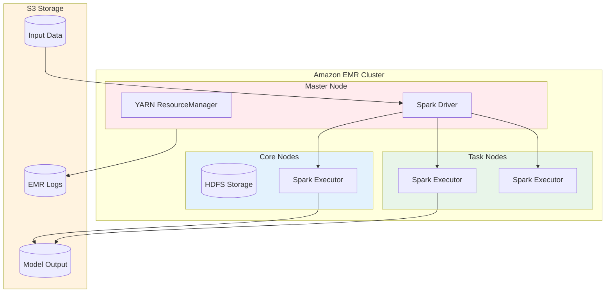
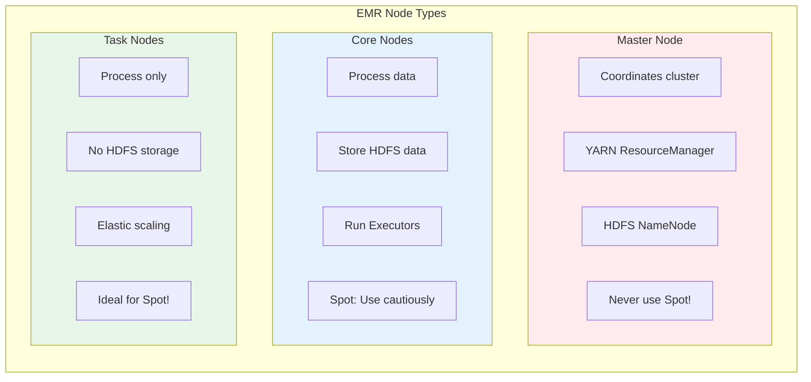
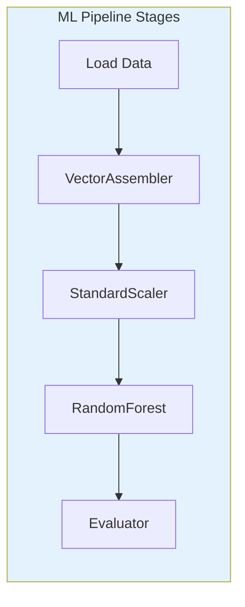

# Lab 14: Amazon EMR for Spark ML

## Overview
Use Amazon EMR with Spark MLlib for distributed machine learning.

**Duration**: 60-90 minutes
**Cost**: ~$5-10 (EMR cluster costs)
**Prerequisites**: Understanding of Spark basics

---

## Architecture Overview



### EMR Node Types



### Spark MLlib Pipeline



---

## Lab Objectives

- [ ] Create an EMR cluster
- [ ] Submit a Spark ML job
- [ ] Use Spark MLlib for training
- [ ] Understand EMR node types

---

## Part 1: Create EMR Cluster

### Step 1.1: Create S3 Bucket for Data

```bash
BUCKET="emr-lab-$(date +%Y%m%d)-$RANDOM"
aws s3 mb s3://$BUCKET

# Upload sample data
cat > sample_data.csv << 'EOF'
label,feature1,feature2,feature3,feature4,feature5
0,1.2,3.4,5.6,7.8,9.0
1,2.3,4.5,6.7,8.9,1.0
0,3.4,5.6,7.8,9.0,2.1
1,4.5,6.7,8.9,1.0,3.2
0,5.6,7.8,9.0,2.1,4.3
1,6.7,8.9,1.0,3.2,5.4
EOF

aws s3 cp sample_data.csv s3://$BUCKET/data/
```

### Step 1.2: Create EMR Cluster

```bash
# Create cluster
CLUSTER_ID=$(aws emr create-cluster \
    --name "ML-Lab-Cluster" \
    --release-label emr-6.10.0 \
    --applications Name=Spark \
    --instance-type m5.xlarge \
    --instance-count 3 \
    --use-default-roles \
    --log-uri s3://$BUCKET/logs/ \
    --query 'ClusterId' \
    --output text)

echo "Cluster ID: $CLUSTER_ID"

# Wait for cluster to be ready
aws emr wait cluster-running --cluster-id $CLUSTER_ID
echo "Cluster is running!"
```

---

## Part 2: Create Spark ML Script

```bash
# Create PySpark ML script
cat > spark_ml_job.py << 'EOF'
from pyspark.sql import SparkSession
from pyspark.ml import Pipeline
from pyspark.ml.feature import VectorAssembler, StandardScaler
from pyspark.ml.classification import RandomForestClassifier
from pyspark.ml.evaluation import BinaryClassificationEvaluator
import sys

# Get arguments
input_path = sys.argv[1]
output_path = sys.argv[2]

# Create Spark session
spark = SparkSession.builder \
    .appName("SparkMLLab") \
    .getOrCreate()

# Load data
df = spark.read.csv(input_path, header=True, inferSchema=True)
print(f"Loaded {df.count()} records")

# Feature columns
feature_cols = [c for c in df.columns if c != 'label']

# Build pipeline
assembler = VectorAssembler(
    inputCols=feature_cols,
    outputCol="features"
)

scaler = StandardScaler(
    inputCol="features",
    outputCol="scaled_features"
)

rf = RandomForestClassifier(
    featuresCol="scaled_features",
    labelCol="label",
    numTrees=100
)

pipeline = Pipeline(stages=[assembler, scaler, rf])

# Split data
train_df, test_df = df.randomSplit([0.8, 0.2], seed=42)

# Train model
model = pipeline.fit(train_df)

# Evaluate
predictions = model.transform(test_df)
evaluator = BinaryClassificationEvaluator(labelCol="label")
auc = evaluator.evaluate(predictions)

print(f"Test AUC: {auc:.4f}")

# Save model
model.write().overwrite().save(output_path)
print(f"Model saved to {output_path}")

spark.stop()
EOF

# Upload script
aws s3 cp spark_ml_job.py s3://$BUCKET/scripts/
```

---

## Part 3: Submit Spark Job

```bash
# Add step to run the job
aws emr add-steps \
    --cluster-id $CLUSTER_ID \
    --steps Type=Spark,Name="ML Training",\
ActionOnFailure=CONTINUE,\
Args=[--deploy-mode,cluster,--master,yarn,\
s3://$BUCKET/scripts/spark_ml_job.py,\
s3://$BUCKET/data/,\
s3://$BUCKET/model/]

# Monitor step
aws emr list-steps --cluster-id $CLUSTER_ID \
    --query 'Steps[0].{Name:Name,State:Status.State}'
```

---

## Part 4: EMR Serverless Alternative

```python
# EMR Serverless (no cluster management)
import boto3

emr_serverless = boto3.client('emr-serverless')

# Create application
app = emr_serverless.create_application(
    name='ml-serverless-app',
    releaseLabel='emr-6.10.0',
    type='SPARK'
)

# Submit job
job = emr_serverless.start_job_run(
    applicationId=app['applicationId'],
    executionRoleArn=role_arn,
    jobDriver={
        'sparkSubmit': {
            'entryPoint': 's3://bucket/scripts/spark_ml_job.py',
            'entryPointArguments': ['s3://bucket/data/', 's3://bucket/model/']
        }
    }
)
```

---

## Part 5: Clean Up

```bash
# Terminate cluster
aws emr terminate-clusters --cluster-ids $CLUSTER_ID

# Wait for termination
aws emr wait cluster-terminated --cluster-id $CLUSTER_ID

# Delete S3 data
aws s3 rm s3://$BUCKET --recursive
aws s3 rb s3://$BUCKET

# Clean local files
rm -f sample_data.csv spark_ml_job.py
```

---

## Lab Summary

| Concept | What You Did |
|---------|--------------|
| **EMR Cluster** | Created Spark cluster |
| **Spark MLlib** | Built ML pipeline |
| **Job Submission** | Ran training as EMR step |
| **EMR Serverless** | Understood alternative |

---

## Exam Relevance

- ✅ EMR node types (Master, Core, Task)
- ✅ Spot instances for Task nodes
- ✅ EMR vs Glue vs SageMaker Processing
- ✅ EMR Serverless for ad-hoc jobs

---

## Next Lab

Continue to [Lab 15: Athena Analysis](../15-athena-analysis/LAB.md) →
