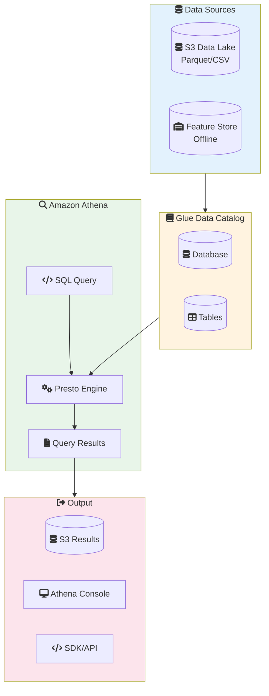
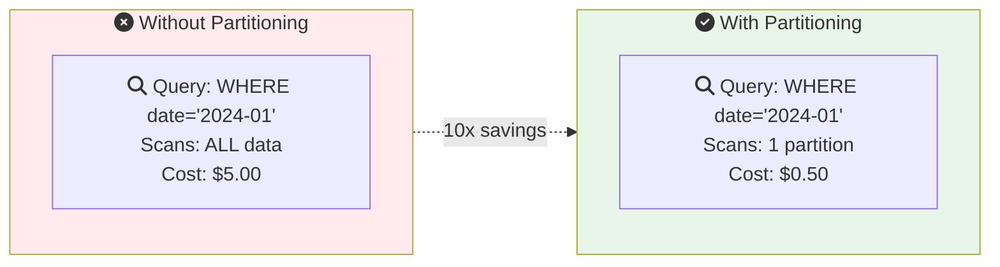
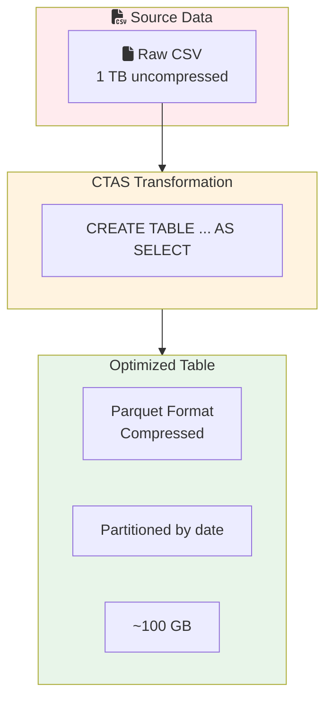

# Lab 15: Amazon Athena for ML Data Analysis

## Overview
Use Athena to query and analyze ML data stored in S3.

**Duration**: 30-45 minutes
**Cost**: ~$0.50 (pay per TB scanned)
**Prerequisites**: S3 bucket with data

---

## Architecture Overview



### Cost Optimization with Partitioning



### CTAS Optimization Pattern



---

## Lab Objectives

- [ ] Create Athena tables from S3 data
- [ ] Run analytical queries
- [ ] Optimize with partitioning
- [ ] Use CTAS for data transformation

---

## Part 1: Setup and Create Table

### Step 1.1: Create Database and Table

```sql
-- Create database
CREATE DATABASE IF NOT EXISTS ml_lab;

-- Create table from S3 data (Glue Catalog)
CREATE EXTERNAL TABLE ml_lab.customer_features (
    customer_id STRING,
    age INT,
    tenure_days INT,
    total_purchases INT,
    total_spend DOUBLE,
    avg_order_value DOUBLE,
    customer_segment STRING,
    churn_label INT
)
ROW FORMAT DELIMITED
FIELDS TERMINATED BY ','
STORED AS TEXTFILE
LOCATION 's3://YOUR_BUCKET/ml-data/features/'
TBLPROPERTIES ('skip.header.line.count'='1');
```

---

## Part 2: Data Exploration Queries

```sql
-- Basic statistics
SELECT
    COUNT(*) as total_customers,
    AVG(age) as avg_age,
    AVG(total_spend) as avg_spend,
    SUM(CASE WHEN churn_label = 1 THEN 1 ELSE 0 END) as churned,
    ROUND(AVG(CAST(churn_label AS DOUBLE)) * 100, 2) as churn_rate_pct
FROM ml_lab.customer_features;

-- Distribution by segment
SELECT
    customer_segment,
    COUNT(*) as count,
    AVG(total_spend) as avg_spend,
    AVG(CAST(churn_label AS DOUBLE)) as churn_rate
FROM ml_lab.customer_features
GROUP BY customer_segment
ORDER BY avg_spend DESC;

-- Check for nulls
SELECT
    COUNT(*) as total,
    SUM(CASE WHEN age IS NULL THEN 1 ELSE 0 END) as null_age,
    SUM(CASE WHEN total_spend IS NULL THEN 1 ELSE 0 END) as null_spend
FROM ml_lab.customer_features;
```

---

## Part 3: Feature Analysis

```sql
-- Age distribution by churn
SELECT
    CASE
        WHEN age < 25 THEN '18-24'
        WHEN age < 35 THEN '25-34'
        WHEN age < 45 THEN '35-44'
        WHEN age < 55 THEN '45-54'
        ELSE '55+'
    END as age_group,
    COUNT(*) as count,
    AVG(CAST(churn_label AS DOUBLE)) as churn_rate
FROM ml_lab.customer_features
GROUP BY 1
ORDER BY 1;

-- Correlation proxy: spend deciles vs churn
SELECT
    ntile(10) OVER (ORDER BY total_spend) as spend_decile,
    COUNT(*) as count,
    AVG(total_spend) as avg_spend,
    AVG(CAST(churn_label AS DOUBLE)) as churn_rate
FROM ml_lab.customer_features
GROUP BY ntile(10) OVER (ORDER BY total_spend)
ORDER BY spend_decile;
```

---

## Part 4: Create Optimized Table (CTAS)

```sql
-- Create partitioned Parquet table for better performance
CREATE TABLE ml_lab.features_optimized
WITH (
    format = 'PARQUET',
    external_location = 's3://YOUR_BUCKET/ml-data/features-optimized/',
    partitioned_by = ARRAY['customer_segment']
) AS
SELECT
    customer_id,
    age,
    tenure_days,
    total_purchases,
    total_spend,
    avg_order_value,
    churn_label,
    customer_segment
FROM ml_lab.customer_features;

-- Query optimized table (only scans needed partition)
SELECT *
FROM ml_lab.features_optimized
WHERE customer_segment = 'premium'
LIMIT 10;
```

---

## Part 5: Query Feature Store

```sql
-- Query SageMaker Feature Store offline data
SELECT
    customer_id,
    total_purchases,
    total_spend,
    event_time
FROM "sagemaker_featurestore"."customer_features"
WHERE event_time >= CAST('2024-01-01' AS TIMESTAMP)
LIMIT 100;

-- Aggregate features
SELECT
    customer_segment,
    COUNT(DISTINCT customer_id) as unique_customers,
    AVG(total_spend) as avg_spend
FROM "sagemaker_featurestore"."customer_features"
GROUP BY customer_segment;
```

---

## Part 6: Clean Up

```sql
-- Drop tables
DROP TABLE IF EXISTS ml_lab.customer_features;
DROP TABLE IF EXISTS ml_lab.features_optimized;
DROP DATABASE IF EXISTS ml_lab;
```

```bash
# Delete S3 data
aws s3 rm s3://YOUR_BUCKET/ml-data/ --recursive
aws s3 rm s3://YOUR_BUCKET/athena-results/ --recursive
```

---

## Lab Summary

| Concept | What You Did |
|---------|--------------|
| **External Tables** | Created from S3 data |
| **Analysis** | Ran exploratory queries |
| **CTAS** | Created optimized Parquet table |
| **Partitioning** | Improved query performance |

---

## Exam Relevance

- ✅ Athena pricing (per TB scanned)
- ✅ CTAS for data transformation
- ✅ Partitioning for cost optimization
- ✅ Athena + Feature Store integration

---

## Next Lab

Continue to [Lab 16: CloudWatch Alerts](../16-cloudwatch-alerts/LAB.md) →
