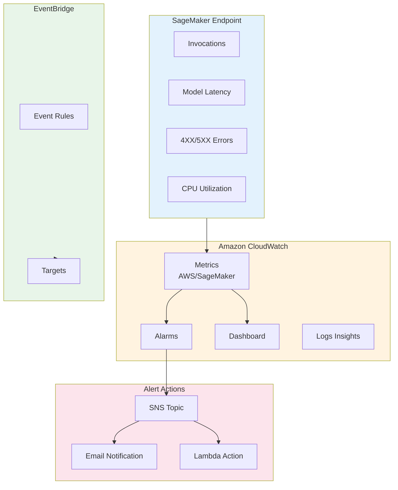
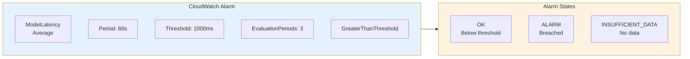
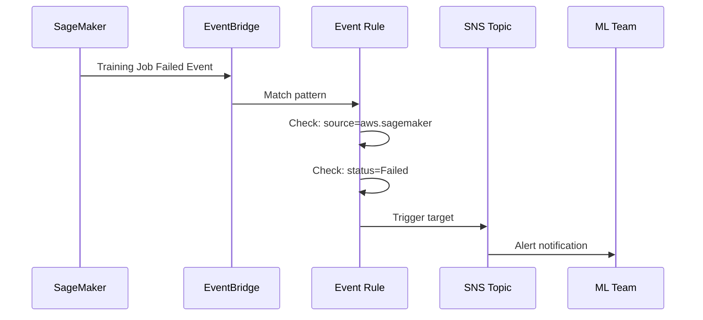
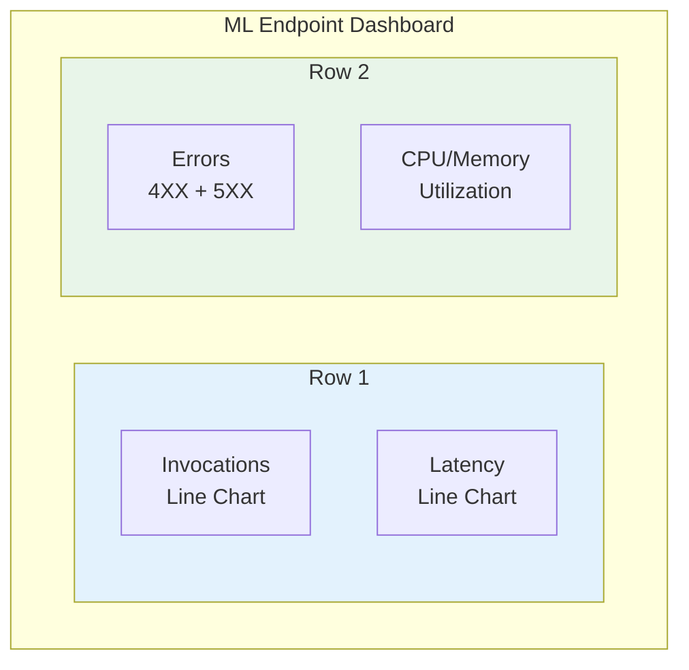

# Lab 16: CloudWatch for ML Monitoring & Alerts

## Overview
Set up CloudWatch monitoring and alerts for ML workloads.

**Duration**: 30-45 minutes
**Cost**: ~$0.50
**Prerequisites**: Deployed SageMaker endpoint

---

## Architecture Overview



### Alarm Configuration



### EventBridge ML Events



### Dashboard Layout



---

## Lab Objectives

- [ ] Monitor SageMaker endpoint metrics
- [ ] Create CloudWatch alarms
- [ ] Build a monitoring dashboard
- [ ] Set up SNS notifications

---

## Part 1: Create SNS Topic for Alerts

```bash
# Create SNS topic
TOPIC_ARN=$(aws sns create-topic --name ml-alerts --query 'TopicArn' --output text)
echo "Topic ARN: $TOPIC_ARN"

# Subscribe email (optional)
aws sns subscribe \
    --topic-arn $TOPIC_ARN \
    --protocol email \
    --notification-endpoint your@email.com
```

---

## Part 2: Create CloudWatch Alarms

### Step 2.1: Latency Alarm

```bash
ENDPOINT_NAME="your-endpoint-name"

# High latency alarm
aws cloudwatch put-metric-alarm \
    --alarm-name "ML-Endpoint-High-Latency" \
    --metric-name ModelLatency \
    --namespace AWS/SageMaker \
    --statistic Average \
    --period 60 \
    --threshold 1000 \
    --comparison-operator GreaterThanThreshold \
    --evaluation-periods 3 \
    --alarm-actions $TOPIC_ARN \
    --dimensions Name=EndpointName,Value=$ENDPOINT_NAME Name=VariantName,Value=AllTraffic \
    --alarm-description "Model latency exceeds 1 second"
```

### Step 2.2: Error Rate Alarm

```bash
# 5XX error alarm
aws cloudwatch put-metric-alarm \
    --alarm-name "ML-Endpoint-Errors" \
    --metric-name Invocation5XXErrors \
    --namespace AWS/SageMaker \
    --statistic Sum \
    --period 300 \
    --threshold 10 \
    --comparison-operator GreaterThanThreshold \
    --evaluation-periods 1 \
    --alarm-actions $TOPIC_ARN \
    --dimensions Name=EndpointName,Value=$ENDPOINT_NAME \
    --alarm-description "Too many 5XX errors"
```

### Step 2.3: CPU Utilization Alarm

```bash
# High CPU alarm
aws cloudwatch put-metric-alarm \
    --alarm-name "ML-Endpoint-High-CPU" \
    --metric-name CPUUtilization \
    --namespace "/aws/sagemaker/Endpoints" \
    --statistic Average \
    --period 60 \
    --threshold 80 \
    --comparison-operator GreaterThanThreshold \
    --evaluation-periods 3 \
    --alarm-actions $TOPIC_ARN \
    --dimensions Name=EndpointName,Value=$ENDPOINT_NAME Name=VariantName,Value=AllTraffic \
    --alarm-description "CPU utilization above 80%"
```

---

## Part 3: Create Dashboard

```python
import boto3
import json

cloudwatch = boto3.client('cloudwatch')

ENDPOINT_NAME = "your-endpoint-name"

dashboard_body = {
    "widgets": [
        {
            "type": "metric",
            "x": 0, "y": 0, "width": 12, "height": 6,
            "properties": {
                "title": "Invocations",
                "metrics": [
                    ["AWS/SageMaker", "Invocations", "EndpointName", ENDPOINT_NAME]
                ],
                "period": 60,
                "stat": "Sum"
            }
        },
        {
            "type": "metric",
            "x": 12, "y": 0, "width": 12, "height": 6,
            "properties": {
                "title": "Model Latency",
                "metrics": [
                    ["AWS/SageMaker", "ModelLatency", "EndpointName", ENDPOINT_NAME]
                ],
                "period": 60,
                "stat": "Average"
            }
        },
        {
            "type": "metric",
            "x": 0, "y": 6, "width": 12, "height": 6,
            "properties": {
                "title": "Errors",
                "metrics": [
                    ["AWS/SageMaker", "Invocation4XXErrors", "EndpointName", ENDPOINT_NAME],
                    ["AWS/SageMaker", "Invocation5XXErrors", "EndpointName", ENDPOINT_NAME]
                ],
                "period": 60,
                "stat": "Sum"
            }
        },
        {
            "type": "metric",
            "x": 12, "y": 6, "width": 12, "height": 6,
            "properties": {
                "title": "Resource Utilization",
                "metrics": [
                    ["/aws/sagemaker/Endpoints", "CPUUtilization",
                     "EndpointName", ENDPOINT_NAME, "VariantName", "AllTraffic"],
                    ["/aws/sagemaker/Endpoints", "MemoryUtilization",
                     "EndpointName", ENDPOINT_NAME, "VariantName", "AllTraffic"]
                ],
                "period": 60,
                "stat": "Average"
            }
        }
    ]
}

cloudwatch.put_dashboard(
    DashboardName='ML-Endpoint-Monitoring',
    DashboardBody=json.dumps(dashboard_body)
)

print("Dashboard created: ML-Endpoint-Monitoring")
```

---

## Part 4: CloudWatch Logs Insights

```python
# Query SageMaker logs for errors
logs = boto3.client('logs')

query = """
fields @timestamp, @message
| filter @message like /ERROR/ or @message like /Exception/
| sort @timestamp desc
| limit 50
"""

response = logs.start_query(
    logGroupName=f'/aws/sagemaker/Endpoints/{ENDPOINT_NAME}',
    startTime=int((datetime.now() - timedelta(hours=1)).timestamp()),
    endTime=int(datetime.now().timestamp()),
    queryString=query
)

# Get results
query_id = response['queryId']
# Wait and get results with get_query_results
```

---

## Part 5: EventBridge for ML Events

```python
import boto3

events = boto3.client('events')

# Create rule for training job failures
events.put_rule(
    Name='training-job-failed',
    EventPattern=json.dumps({
        "source": ["aws.sagemaker"],
        "detail-type": ["SageMaker Training Job State Change"],
        "detail": {
            "TrainingJobStatus": ["Failed"]
        }
    }),
    State='ENABLED'
)

# Add SNS target
events.put_targets(
    Rule='training-job-failed',
    Targets=[{
        'Id': 'sns-alert',
        'Arn': TOPIC_ARN,
        'InputTransformer': {
            'InputPathsMap': {
                'jobName': '$.detail.TrainingJobName',
                'status': '$.detail.TrainingJobStatus'
            },
            'InputTemplate': '"Training job <jobName> has <status>"'
        }
    }]
)
```

---

## Part 6: Clean Up

```bash
# Delete alarms
aws cloudwatch delete-alarms --alarm-names \
    "ML-Endpoint-High-Latency" \
    "ML-Endpoint-Errors" \
    "ML-Endpoint-High-CPU"

# Delete dashboard
aws cloudwatch delete-dashboards --dashboard-names ML-Endpoint-Monitoring

# Delete EventBridge rule
aws events remove-targets --rule training-job-failed --ids sns-alert
aws events delete-rule --name training-job-failed

# Delete SNS topic
aws sns delete-topic --topic-arn $TOPIC_ARN

echo "Cleanup complete!"
```

---

## Lab Summary

| Concept | What You Did |
|---------|--------------|
| **Alarms** | Created latency, error, CPU alarms |
| **Dashboard** | Built visual monitoring |
| **Logs Insights** | Queried for errors |
| **EventBridge** | Set up event-driven alerts |

---

## Exam Relevance

- ✅ SageMaker CloudWatch metrics
- ✅ Alarm configuration and thresholds
- ✅ EventBridge for ML automation
- ✅ Model Monitor CloudWatch integration

---

## Congratulations!

You've completed all 16 labs in the AWS ML Associate exam preparation path.

### Next Steps:
1. Review all concepts in the README files
2. Take AWS practice exams
3. Focus on areas where you struggled
4. Schedule your certification exam!

**Good luck with your AWS ML Engineer Associate certification!**
